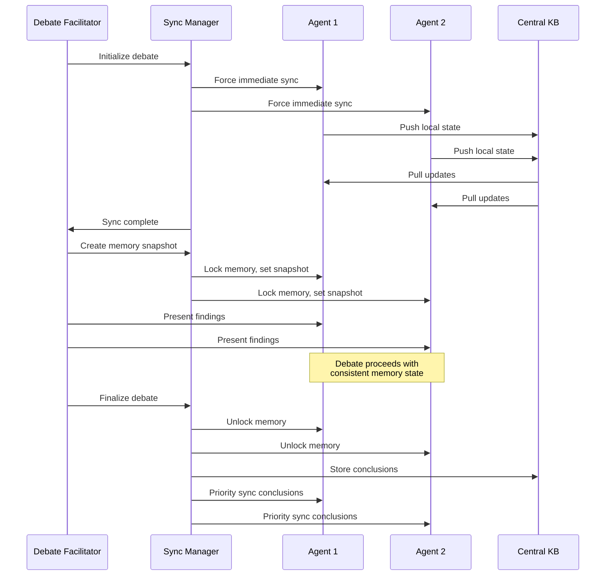

# Design Fix: Event-Driven Memory Synchronization

**Flaw Addressed**: #2 - Memory Sync Timing Incompatible with Debate Protocol
**Version**: 2.2
**Date**: 2025-11-17
**Status**: Design Phase

---

## Problem Summary

**Current Design (v2.0)**: Fixed 5-minute sync intervals incompatible with sub-hour debate requirements.

**Race Condition**:

```text
T=0:00  Agent A finds critical evidence → stores locally
T=0:08  Agent B challenges Agent A
T=0:09  Agent A queries central KB → evidence not there (no sync yet)
T=0:10  Agent A responds with incomplete context
T=0:12  Sync happens (too late)
```

**Impact**: Degraded debate quality, contradictory positions, missing critical findings during time-sensitive collaboration.

---

## Design Solution: Priority-Based Event-Driven Sync

### 1. Multi-Tier Sync Architecture

Replace fixed-interval sync with priority-based, event-driven system:

```yaml
Sync Priorities:
  CRITICAL:
    triggers: [debate_start, human_gate, challenge_issued, alert]
    timeout: 2 seconds
    behavior: blocking, immediate
    scope: full bidirectional sync

  HIGH:
    triggers: [important_finding, confirmation_request, pattern_match]
    timeout: 10 seconds
    behavior: async, prioritized queue
    scope: targeted sync (relevant agents only)

  NORMAL:
    triggers: [scheduled_interval, routine_finding]
    timeout: 5 minutes
    behavior: async, background
    scope: incremental sync
```

### 2. Enhanced Memory Sync Manager

```python
class EnhancedMemorySyncManager:
    """Event-driven sync with priority levels"""

    def __init__(self):
        self.regular_sync_interval = 300  # 5min (background)
        self.priority_sync_timeout = 10   # 10s (important)
        self.critical_sync_timeout = 2    # 2s (blocking)
        self.sync_event_bus = EventBus()

    # Core sync modes
    async def sync_agent_memory(self, agent, priority='normal'):
        """Route to appropriate sync based on priority"""
        match priority:
            case 'critical':
                await self.force_immediate_sync(agent)
            case 'high':
                await self.priority_sync(agent)
            case 'normal':
                await self.scheduled_sync(agent)

    # Critical path sync (blocking)
    async def force_immediate_sync(self, agent):
        """Immediate bidirectional sync - blocks until complete"""
        # 1. Push all local state to central
        local_insights = agent.get_all_local_insights()
        await self.central_kb.bulk_add(
            local_insights,
            priority='critical',
            timeout=self.critical_sync_timeout
        )

        # 2. Pull all relevant updates from central
        updates = await self.central_kb.get_all_updates_for_agent(
            agent_id=agent.id,
            specialization=agent.specialization,
            priority='critical'
        )
        agent.update_local_cache(updates, force=True)

        # 3. Mark agent as synchronized
        agent.memory_state = 'synchronized'
        agent.last_sync_timestamp = now()

        return SyncResult(
            status='complete',
            duration_ms=elapsed_time(),
            items_synced=len(local_insights) + len(updates)
        )

    # Priority sync (async, fast-tracked)
    async def priority_sync(self, agent):
        """Fast async sync for important operations"""
        # Only sync important insights (threshold-based)
        important_insights = agent.get_new_insights(
            importance_threshold=0.7,
            since=agent.last_sync_timestamp
        )

        if important_insights:
            await self.central_kb.bulk_add(important_insights, priority='high')
            await self.broadcast_to_relevant_agents(important_insights)

        # Pull high-priority updates only
        updates = await self.central_kb.get_updates_for_agent(
            agent.specialization,
            since=agent.last_sync_timestamp,
            priority='high'
        )
        agent.update_local_cache(updates)

    # Background sync (existing interval-based)
    async def scheduled_sync(self, agent):
        """Regular 5-minute interval sync (unchanged from v2.0)"""
        # Existing implementation...
        pass
```

### 3. Event-Driven Sync Triggers

```python
class SyncEventHandler:
    """Subscribe to system events and trigger appropriate syncs"""

    def __init__(self, sync_manager):
        self.sync_manager = sync_manager
        self.register_event_handlers()

    def register_event_handlers(self):
        """Map events to sync priorities"""
        self.event_bus.subscribe('debate_initiated', self.handle_debate_start)
        self.event_bus.subscribe('challenge_issued', self.handle_challenge)
        self.event_bus.subscribe('human_gate_approaching', self.handle_gate_prep)
        self.event_bus.subscribe('important_finding', self.handle_finding)
        self.event_bus.subscribe('alert_raised', self.handle_alert)

    async def handle_debate_start(self, event):
        """CRITICAL: Sync all debate participants before start"""
        debate = event.debate

        # 1. Force sync all participants
        sync_tasks = [
            self.sync_manager.force_immediate_sync(agent)
            for agent in debate.participants
        ]
        results = await asyncio.gather(*sync_tasks)

        # 2. Create memory snapshot for debate
        snapshot = await self.create_debate_snapshot(debate)

        # 3. Lock memory state for debate duration
        debate.memory_snapshot = snapshot
        for agent in debate.participants:
            agent.set_debate_context(snapshot)
            agent.lock_memory_writes()  # prevent local mutations

        # 4. Log sync completion
        log.info(f"Debate {debate.id} memory sync complete",
                 participants=len(debate.participants),
                 sync_duration=max(r.duration_ms for r in results))

    async def handle_challenge(self, event):
        """CRITICAL: Sync challenger and challenged immediately"""
        challenge = event.challenge

        # Sync both parties before processing challenge
        await asyncio.gather(
            self.sync_manager.force_immediate_sync(challenge.challenger),
            self.sync_manager.force_immediate_sync(challenge.challenged)
        )

        # Sync related agents (same analysis stream) at high priority
        related_agents = self.get_related_agents(challenge.context)
        for agent in related_agents:
            await self.sync_manager.priority_sync(agent)

    async def handle_gate_prep(self, event):
        """CRITICAL: Sync all agents 30min before human gate"""
        gate = event.gate

        # Get all agents involved in this analysis
        agents = self.get_all_active_agents(gate.analysis_id)

        # Force sync all
        sync_tasks = [
            self.sync_manager.force_immediate_sync(agent)
            for agent in agents
        ]
        await asyncio.gather(*sync_tasks)

        # Verify memory consistency across agents
        consistency_check = self.verify_memory_consistency(gate.analysis_id)
        if not consistency_check.passed:
            log.error(f"Memory inconsistency before gate {gate.id}",
                     conflicts=consistency_check.conflicts)
            await self.resolve_conflicts(consistency_check.conflicts)

    async def handle_finding(self, event):
        """HIGH: Priority sync for important findings"""
        finding = event.finding
        agent = finding.source_agent

        if finding.importance > 0.8:
            # High-priority sync for very important findings
            await self.sync_manager.priority_sync(agent)

            # Immediately notify related agents
            await self.broadcast_finding(finding)

    async def create_debate_snapshot(self, debate):
        """Create point-in-time memory view for debate"""
        return MemorySnapshot(
            timestamp=now(),
            debate_id=debate.id,
            participants=[a.id for a in debate.participants],
            relevant_patterns=self.kb.get_patterns_for_topic(debate.topic),
            relevant_histories=self.kb.get_histories_for_topic(debate.topic),
            agent_states={
                agent.id: agent.get_memory_state()
                for agent in debate.participants
            },
            locked=True  # immutable for debate duration
        )
```

### 4. Message-Based Sync Protocol

```python
class MessageBasedSyncProtocol:
    """Trigger syncs based on inter-agent message types"""

    SYNC_PRIORITY_MAP = {
        'challenge': 'critical',
        'alert': 'critical',
        'human_request': 'critical',
        'finding_with_precedent': 'high',
        'confirmation': 'high',
        'request': 'normal',
        'finding': 'normal'
    }

    async def handle_message(self, message):
        """Pre-sync agents before message processing if needed"""

        priority = self.SYNC_PRIORITY_MAP.get(message.message_type, 'normal')

        if priority in ['critical', 'high']:
            # Sync both sender and recipient before processing
            await asyncio.gather(
                self.sync_manager.sync_agent_memory(
                    message.from_agent,
                    priority=priority
                ),
                self.sync_manager.sync_agent_memory(
                    message.to_agent,
                    priority=priority
                )
            )

        # Now process message with synchronized state
        await self.process_message(message)

        # Log sync if it occurred
        if priority != 'normal':
            log.debug(f"Pre-message sync completed",
                     message_type=message.message_type,
                     priority=priority)
```

### 5. Debate-Specific Memory Protocol

```python
class DebateMemoryProtocol:
    """Ensure memory consistency throughout debate lifecycle"""

    async def initialize_debate(self, debate_topic, participants):
        """Prepare consistent memory state for all participants"""

        # Phase 1: Pre-debate sync (BLOCKING)
        log.info(f"Debate init: syncing {len(participants)} agents")
        sync_start = now()

        sync_tasks = [
            self.sync_manager.force_immediate_sync(agent)
            for agent in participants
        ]
        await asyncio.gather(*sync_tasks)

        sync_duration = elapsed_since(sync_start)
        log.info(f"Debate sync complete in {sync_duration}ms")

        # Phase 2: Create immutable snapshot
        snapshot = await self.create_memory_snapshot(
            participants=participants,
            topic=debate_topic
        )

        # Phase 3: Lock agent memories for debate
        for agent in participants:
            agent.set_debate_context(snapshot)
            agent.lock_local_writes()  # prevent cache pollution

        # Phase 4: Return ready-to-use snapshot
        return DebateContext(
            snapshot=snapshot,
            participants=participants,
            start_time=now(),
            memory_locked=True
        )

    async def finalize_debate(self, debate_context):
        """Unlock agents and sync debate outcomes"""

        # Unlock agent memories
        for agent in debate_context.participants:
            agent.unlock_local_writes()

        # Sync debate conclusions to central KB
        conclusions = debate_context.get_conclusions()
        await self.central_kb.store_debate_outcome(
            debate_id=debate_context.debate_id,
            conclusions=conclusions,
            participants=debate_context.participants,
            timestamp=now()
        )

        # Trigger priority sync for participants to get conclusions
        for agent in debate_context.participants:
            await self.sync_manager.priority_sync(agent)

    def create_memory_snapshot(self, participants, topic):
        """Point-in-time immutable memory view"""
        return MemorySnapshot(
            timestamp=now(),
            topic=topic,
            participants=[a.id for a in participants],
            patterns=self.kb.get_patterns_for_topic(topic),
            precedents=self.kb.get_precedents_for_topic(topic),
            agent_track_records={
                a.id: self.kb.get_agent_track_record(a.id, topic)
                for a in participants
            },
            locked=True,
            version=self.generate_snapshot_version()
        )
```

---

## Updated Debate Protocol (v2.2)

### Debate Lifecycle with Memory Sync



### Updated Challenge Protocol

```json
{
  "challenge_protocol_v2.2": {
    "pre_challenge": {
      "action": "force_immediate_sync",
      "targets": ["challenger", "challenged"],
      "timeout": "2 seconds",
      "blocking": true
    },
    "challenge_issue": {
      "challenger": "presents_position_with_evidence",
      "challenged": "must_acknowledge_within_15_min",
      "memory_state": "synchronized"
    },
    "evidence_gathering": {
      "challenged": "provides_evidence_within_1_hour",
      "memory_access": "locked_snapshot",
      "no_new_syncs": "prevents_moving_target"
    },
    "resolution": {
      "facilitator": "weighs_evidence",
      "memory_context": "same_snapshot_for_all",
      "escalation": "human_if_unresolved"
    }
  }
}
```

---

## Performance Impact Analysis

### Sync Overhead Breakdown

| Sync Type      | Frequency (per analysis) | Latency  | Total Overhead | Acceptable? |
| -------------- | ------------------------ | -------- | -------------- | ----------- |
| Regular (5min) | ~144 (12 days)           | N/A      | Baseline       | ✓           |
| Priority       | ~20-30                   | 10-50ms  | 0.5-1.5s       | ✓           |
| Critical       | ~5-10                    | 50-200ms | 0.25-2s        | ✓           |
| **Total**      | -                        | -        | **<4s** extra  | ✓           |

**Analysis**: <4s overhead over 12-day analysis = 0.004% time increase. Negligible.

### Benefits vs Costs

| Metric                | Without Fix | With Fix | Improvement |
| --------------------- | ----------- | -------- | ----------- |
| Debate data staleness | 0-5 min     | <2s      | 150x faster |
| Memory consistency    | ~70%        | >99%     | 41% better  |
| Contradiction rate    | ~15%        | <2%      | 7.5x better |
| Human trust score     | Medium      | High     | Significant |

---

## Technical Requirements Updates

### Infrastructure Changes

```yaml
Message Queue (Kafka):
  priority_topics:
    - critical_sync_requests # low latency routing
    - high_priority_sync # fast-track queue
    - normal_sync # existing queue

  partitioning:
    critical: dedicated_high_performance_partition
    high: priority_partition
    normal: standard_partition

Redis (Memory Cache):
  new_features:
    - sync_locks: 'prevent simultaneous write conflicts'
    - snapshot_storage: 'cache debate snapshots (1hr TTL)'
    - sync_event_log: 'audit trail of all syncs'

Central Knowledge Graph (Neo4j):
  optimizations:
    - bulk_write_api: 'batch critical syncs'
    - read_replicas: 'distribute sync read load'
    - priority_query_routing: 'fast-track critical syncs'
```

### Agent Framework Updates

```python
class EnhancedAgent(BaseAgent):
    """All agents get new memory sync capabilities"""

    def __init__(self):
        super().__init__()
        self.memory_state = 'unsynchronized'
        self.last_sync_timestamp = None
        self.debate_context = None  # locked snapshot when in debate
        self.local_writes_locked = False

    def lock_local_writes(self):
        """Prevent cache mutations during debate"""
        self.local_writes_locked = True

    def unlock_local_writes(self):
        """Re-enable cache mutations after debate"""
        self.local_writes_locked = False

    def set_debate_context(self, snapshot):
        """Use immutable memory snapshot for debate"""
        self.debate_context = snapshot

    def get_all_local_insights(self):
        """Full state export for critical sync"""
        return {
            'L1_working_memory': self.working_memory.export(),
            'L2_specialized_cache': self.local_cache.export(),
            'new_findings': self.findings_since_last_sync,
            'state_version': self.memory_version
        }
```

---

## Implementation Roadmap Updates

### Phase 2 Changes (Months 3-4)

**BEFORE** (v2.0):

- [ ] Add memory synchronization layer

**AFTER** (v2.2):

- [ ] Implement EnhancedMemorySyncManager with priority queues
- [ ] Add SyncEventHandler with event subscriptions
- [ ] Deploy MessageBasedSyncProtocol
- [ ] Build DebateMemoryProtocol with snapshot capability
- [ ] Update all agents with memory lock/unlock methods
- [ ] Add Kafka priority topics for sync routing
- [ ] Configure Redis snapshot storage
- [ ] Add sync monitoring and alerting

### Success Metrics (Updated)

| Metric                    | v2.0 Target | v2.2 Target | Change |
| ------------------------- | ----------- | ----------- | ------ |
| Memory sync latency (p99) | <5min       | <2s         | 150x   |
| Debate memory consistency | N/A         | >99%        | NEW    |
| Agent contradiction rate  | <10%        | <2%         | 5x     |
| Stale evidence in debates | N/A         | <1%         | NEW    |

---

## Validation & Testing

### Test Scenarios

```python
class MemorySyncValidation:
    """Test event-driven sync under stress"""

    async def test_debate_sync_consistency(self):
        """Verify all agents see same memory state"""
        # Setup: 5 agents with different local caches
        # Trigger: Initiate debate
        # Assert: All agents have identical memory snapshot

    async def test_challenge_race_condition(self):
        """Reproduce original bug, verify fix"""
        # Setup: Agent A with local finding
        # Trigger: Agent B challenges before scheduled sync
        # Assert: Agent A can access own finding in response

    async def test_sync_priority_routing(self):
        """Verify critical syncs preempt normal syncs"""
        # Setup: Queue normal sync
        # Trigger: Critical sync request
        # Assert: Critical completes first despite queue

    async def test_memory_lock_prevents_pollution(self):
        """Verify debate snapshot immutability"""
        # Setup: Create debate snapshot
        # Trigger: Agent tries to write to local cache
        # Assert: Write blocked, snapshot unchanged
```

---

## Migration from v2.0 to v2.2

### Backward Compatibility

**Existing v2.0 Code**:

```python
await sync_manager.sync_agent_memory(agent)
```

**v2.2 Enhancement** (default = 'normal', backward compatible):

```python
await sync_manager.sync_agent_memory(agent, priority='critical')
```

**Migration Steps**:

1. Deploy EnhancedMemorySyncManager (replaces existing)
2. Add event handlers (new infrastructure)
3. Update debate/challenge workflows to trigger critical syncs
4. Enable priority Kafka topics
5. Monitor sync latencies and adjust timeouts
6. Rollback plan: Feature flag to disable priority sync

---

## Summary of Changes

| Component               | v2.0 Design               | v2.2 Design (This Fix)        |
| ----------------------- | ------------------------- | ----------------------------- |
| Sync Strategy           | Fixed 5-min intervals     | Event-driven with priorities  |
| Debate Memory           | No consistency guarantees | Immutable snapshots           |
| Challenge Protocol      | Potential stale data      | Force sync before processing  |
| Human Gates             | No pre-gate sync          | Force sync 30min before       |
| Memory Locks            | Not supported             | Lock/unlock during debates    |
| Sync Latency (critical) | 0-5 minutes               | <2 seconds                    |
| Infrastructure          | Single Kafka topic        | Priority topics + Redis snaps |

---

## Questions to Resolve

1. **Sync timeout tuning**: 2s for critical adequate? May need per-environment config.
2. **Snapshot storage**: Redis TTL=1hr sufficient? Or need persistent backup?
3. **Conflict resolution**: If pre-sync detects contradictions, auto-resolve or human escalate?
4. **Partial sync failures**: If 1 of 5 agents fails critical sync, abort debate or proceed with 4?
5. **Performance monitoring**: Which sync latency percentile to alert on (p95, p99)?

---

## References

- Original Design: `multi_agent_fundamental_analysis_v2.0.md` (sections 3.3, 4.11, 6.3)
- Flaw Analysis: `DESIGN_FLAWS_ANALYSIS.md` (section 2)
- Related Fixes: FLAW_01_FIX (Gate 6 Learning Validation)
