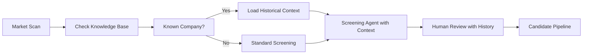
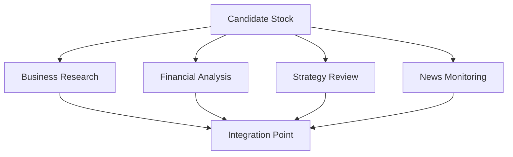
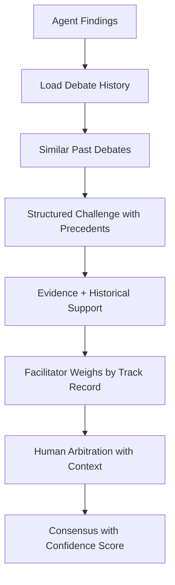
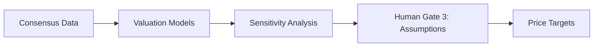

# Multi-Agent Fundamental Analysis System Design Document

## Version 2.0 - Memory-Enhanced Architecture

**Date:** November 2025  
**Status:** Revised Draft  
**Classification:** Internal

---

## Table of Contents

1. [Executive Summary](#executive-summary)
2. [System Overview](#system-overview)
3. [Memory Architecture](#memory-architecture)
4. [Agent Architecture](#agent-architecture)
5. [Memory-Enhanced Workflow](#memory-enhanced-workflow)
6. [Collaborative Intelligence Protocols](#collaborative-intelligence-protocols)
7. [Human-in-the-Loop Integration](#human-in-the-loop-integration)
8. [Data Management](#data-management)
9. [Learning & Feedback Systems](#learning--feedback-systems)
10. [Implementation Roadmap](#implementation-roadmap)
11. [Appendices](#appendices)
    - [A: Technical Requirements](#appendix-a-technical-requirements)
    - [B: Risk Assessment](#appendix-b-risk-assessment)
    - [C: Compliance Considerations](#appendix-c-compliance-considerations)
    - [D: Glossary](#appendix-d-glossary)
    - [E: Memory System Metrics](#appendix-e-memory-system-metrics)
    - [F: Sample Memory-Enhanced Outputs](#appendix-f-sample-memory-enhanced-outputs)
    - [G: Learning Loop Examples](#appendix-g-learning-loop-examples)

---

## Executive Summary

### Purpose

This document outlines the design for a memory-enhanced multi-agent system that performs comprehensive fundamental analysis on stocks, mimicking and exceeding the capabilities of human analyst teams through institutional memory and continuous learning.

### Key Objectives

- Automate screening and initial analysis of investment opportunities
- Provide thorough fundamental analysis across business, financial, and strategic dimensions
- Build and leverage institutional knowledge through comprehensive memory systems
- Learn from past decisions and continuously improve prediction accuracy
- Enable human oversight and input at critical decision points
- Generate professional investment reports and maintain intelligent watchlists

### Core Principles

- **Parallel Processing**: Multiple agents work simultaneously on different aspects
- **Collaborative Intelligence**: Agents debate and validate each other's findings using historical context
- **Memory-Augmented Decisions**: Every analysis leverages past experiences and outcomes
- **Human Augmentation**: Human expertise enhanced by AI memory and pattern recognition
- **Transparency**: All reasoning, memory queries, and decisions are auditable
- **Continuous Learning**: System actively learns from outcomes and updates knowledge base

### What's New in Version 2.0

- **Hybrid Memory Architecture**: Central knowledge graph with local agent caches
- **Knowledge Base Agent**: Dedicated agent for memory management and pattern recognition
- **Memory-Enhanced Debates**: Historical context powers agent discussions
- **Learning Loops**: Systematic capture and application of lessons learned
- **Track Record System**: Agent credibility scoring based on historical accuracy

---

## System Overview

### High-Level Architecture with Memory Integration

```text
┌─────────────────────────────────────────────────────────┐
│                   Human Interface Layer                   │
│    Dashboard | Notifications | Feedback Loop | Analytics  │
└─────────────────────────────────────────────────────────┘
                              ▲
                              ▼
┌─────────────────────────────────────────────────────────┐
│               Memory & Learning Layer                     │
│   Central Knowledge Graph | Learning Engine | Patterns    │
└─────────────────────────────────────────────────────────┘
                              ▲
                              ▼
┌─────────────────────────────────────────────────────────┐
│                   Coordination Layer                      │
│    Lead Coordinator | Debate Facilitator | QC Agent      │
└─────────────────────────────────────────────────────────┘
                              ▲
                              ▼
┌─────────────────────────────────────────────────────────┐
│                  Specialist Agent Layer                   │
│  Screening | Business | Financial | Strategy | Valuation  │
│        (Each with Local Memory Cache)                     │
└─────────────────────────────────────────────────────────┘
                              ▲
                              ▼
┌─────────────────────────────────────────────────────────┐
│                     Support Layer                         │
│   Data Collector | News Monitor | Report Writer | KB Agent│
└─────────────────────────────────────────────────────────┘
                              ▲
                              ▼
┌─────────────────────────────────────────────────────────┐
│                    Data Infrastructure                    │
│    APIs | Databases | Document Storage | Memory Storage   │
└─────────────────────────────────────────────────────────┘
```

#### Layer Descriptions

##### Human Interface Layer

- Provides dashboard for monitoring pipeline, approvals, and decisions
- Sends notifications for critical decision gates and alerts
- Captures human feedback for system learning
- Displays analytics and performance metrics

##### Memory & Learning Layer

- Maintains central knowledge graph of all analyses, patterns, and outcomes
- Runs learning engine to improve agent accuracy over time
- Identifies and validates recurring patterns across analyses
- Synchronizes memories between agents and central storage

##### Coordination Layer

- Lead Coordinator orchestrates workflow and task assignments
- Debate Facilitator structures collaborative analysis and conflict resolution
- QC Agent ensures analysis integrity and identifies contradictions

##### Specialist Agent Layer

- Five specialized agents (Screening, Business, Financial, Strategy, Valuation)
- Each maintains local memory cache for domain-specific patterns
- Performs deep analysis in respective domains
- Participates in collaborative debates with historical context

##### Support Layer

- Data Collector manages acquisition and storage of external data
- News Monitor tracks real-time developments and material events
- Report Writer synthesizes findings into professional documentation
- Knowledge Base Agent manages institutional memory and pattern recognition

##### Data Infrastructure

- External APIs for market data, SEC filings, news feeds
- Multiple database systems (PostgreSQL, MongoDB, Neo4j, Redis)
- Document storage for filings, transcripts, reports
- Specialized memory storage for knowledge graph and agent caches

### Enhanced Analysis Pipeline with Memory

1. **Memory-Informed Screening**

   - Identify candidates based on financial metrics
   - Check if company previously analyzed
   - Load historical screening patterns and accuracy
   - Apply learned filters based on past successes/failures

2. **Historical Context Loading**

   - Pull relevant past analyses and patterns
   - Retrieve similar company outcomes
   - Load sector-specific historical context
   - Identify applicable precedents

3. **Business Understanding**

   - Deep dive into operations and business model
   - Analyze with awareness of past findings
   - Evaluate competitive advantages against historical durability
   - Compare to similar business models in memory

4. **Financial Analysis**

   - Comprehensive review of statements and metrics
   - Compare to historical predictions and accuracy
   - Apply sector-specific ratio benchmarks from memory
   - Identify red flags based on learned patterns

5. **Strategic Assessment**

   - Evaluate management track record and future plans
   - Compare against past management assessments
   - Review capital allocation with historical ROI data
   - Weight by agent accuracy on similar evaluations

6. **Valuation**

   - Determine fair value and price targets
   - Adjust based on historical model performance
   - Apply calibration factors from past prediction errors
   - Generate probability-weighted scenarios from historical outcomes

7. **Documentation**

   - Generate professional reports and maintain watchlists
   - Include confidence scores based on track record
   - Highlight historical precedents and pattern matches
   - Document consensus with credibility weighting

8. **Learning & Feedback**
   - Update knowledge base with new outcomes
   - Track predictions for future accuracy measurement
   - Identify new patterns for validation
   - Update agent credibility scores

---

## Memory Architecture

### Hybrid Memory Model

The system implements a three-tier hybrid memory architecture combining centralized knowledge with distributed agent-specific memories:

```text
┌─────────────────────────────────────────────┐
│      Central Knowledge Graph (Neo4j)         │
│  Companies | Patterns | Decisions | Outcomes │
└─────────────────────────────────────────────┘
                    ▲ ▼ Sync
┌──────────────┬──────────────┬───────────────┐
│   L2 Cache   │   L2 Cache   │   L2 Cache    │
│ Specialized  │ Specialized  │ Specialized   │
├──────────────┼──────────────┼───────────────┤
│  Financial   │   Strategy   │   Valuation   │
│    Agent     │    Agent     │     Agent     │
│ L1: Working  │ L1: Working  │  L1: Working  │
└──────────────┴──────────────┴───────────────┘
```

### Memory Hierarchy

#### L1: Agent Working Memory (RAM)

- **Purpose**: Immediate context for current analysis
- **Contents**: Active calculations, current company data, debate context
- **Size**: ~100 items per agent
- **TTL**: Hours
- **Access Time**: <10ms

#### L2: Agent Specialized Cache (Local Database)

- **Purpose**: Domain-specific patterns and frequently accessed data
- **Contents**:
  - Financial Agent: Ratio patterns, peer comparisons, accounting rules
  - Strategy Agent: Management patterns, capital allocation histories
  - Valuation Agent: Model templates, multiple histories, sector norms
- **Size**: ~10,000 items per agent
- **TTL**: Weeks (with refresh)
- **Access Time**: <100ms

#### L3: Central Knowledge Graph (Graph Database)

- **Purpose**: Permanent institutional knowledge
- **Contents**: All analyses, decisions, outcomes, patterns, relationships
- **Size**: Unlimited
- **TTL**: Permanent
- **Access Time**: <1s

### Knowledge Graph Schema

```yaml
Nodes:
  Company:
    - ticker: string
    - sector: string
    - analyzed_count: integer
    - last_analysis: datetime

  Analysis:
    - id: string
    - date: datetime
    - recommendation: enum
    - confidence: float
    - outcome: float

  Pattern:
    - name: string
    - category: string
    - success_rate: float
    - occurrence_count: integer

  Decision:
    - id: string
    - type: string
    - agents_involved: array
    - outcome: enum

  Agent:
    - name: string
    - specialization: string
    - accuracy_scores: object
    - total_decisions: integer

Relationships:
  - Company -[HAS_ANALYSIS]-> Analysis
  - Analysis -[IDENTIFIED_PATTERN]-> Pattern
  - Analysis -[LED_TO]-> Decision
  - Decision -[HAS_OUTCOME]-> Outcome
  - Agent -[PERFORMED]-> Analysis
  - Agent -[MADE]-> Decision
  - Pattern -[SIMILAR_TO]-> Pattern
  - Company -[PEER_OF]-> Company
```

### Memory Synchronization Protocol

```python
class MemorySyncManager:
    def __init__(self):
        self.sync_interval = 300  # 5 minutes
        self.importance_threshold = 0.7

    async def sync_agent_memory(self, agent):
        # Push important local discoveries to central
        local_insights = agent.get_new_insights()
        for insight in local_insights:
            if insight.importance > self.importance_threshold:
                await self.central_kb.add(insight, source=agent.id)
                await self.broadcast_to_relevant_agents(insight)

        # Pull relevant updates from central
        updates = await self.central_kb.get_updates_for_agent(
            agent.specialization,
            since=agent.last_sync
        )
        agent.update_local_cache(updates)

    def broadcast_to_relevant_agents(self, insight):
        # Determine which agents need immediate awareness
        relevant_agents = self.determine_relevance(insight)
        for agent in relevant_agents:
            agent.notify_important_insight(insight)
```

---

## Agent Architecture

### Enhanced Primary Specialist Agents with Memory

#### 1. Screening Agent (Memory-Enhanced)

**Purpose**: Initial filtering and candidate identification with historical awareness

**Core Responsibilities**:

- Monitor financial screeners (Finviz, custom screeners)
- Apply quantitative filters:
  - 10-year revenue CAGR
  - Operating profit margin
  - Net debt/EBITDA ratios
- Generate one-page company summaries
- Prioritize candidates for deeper analysis

**Memory Capabilities**:

- Track screening pattern success rates by sector
- Remember false positives/negatives and root causes
- Learn which metrics predict success in different market conditions
- Cache frequently screened companies with historical outcomes

**Key Metrics Tracked**:

- Screening efficiency rate (candidates → successful analyses)
- False positive/negative rates with pattern attribution
- Time to identify opportunities
- Pattern accuracy by sector and market regime

**Local Memory Structure**:

```yaml
screening_patterns:
  - pattern_id: 'value_trap_tech'
    description: 'Low P/E tech often value trap'
    success_rate: 0.23
    learned_from: ['INTC_2020', 'IBM_2019']
    sectors: ['Technology']

failed_screens:
  - company: 'XYZ'
    reason: 'Missed accounting irregularity'
    lesson: 'Add cash flow quality check'
    date: '2024-03-15'
```

#### 2. Business Research Agent (Memory-Enhanced)

**Purpose**: Deep understanding of business operations with historical context

**Core Responsibilities**:

- Analyze SEC filings (10-K, 10-Q, 8-K)
- Evaluate business segments and revenue streams
- Assess geographic exposure and concentration risks
- Identify competitive advantages (moats)
- Maintain SWOT analysis framework
- Track key performance indicators (KPIs)

**Research Framework**:

```text
Strengths    | Weaknesses
-------------|-------------
- Moats      | - Risks
- Market pos.| - Dependencies

Opportunities| Threats
-------------|-------------
- Growth     | - Competition
- Expansion  | - Regulation
```

**Memory Capabilities**:

- Store business model patterns and success rates
- Track competitive advantage durability over time
- Remember management track records across companies
- Identify recurring industry themes and cycles
- Cache similar business model outcomes

**Memory Queries During Analysis**:

```python
def analyze_business_model(self, company):
    # Check if we've seen this company before
    past_analyses = self.memory.get_company_history(company)

    # Find similar business models
    similar_models = self.memory.find_similar_patterns(
        industry=company.industry,
        revenue_model=company.revenue_model
    )

    # Get management track record
    mgmt_history = self.central_kb.get_management_history(
        company.executives
    )

    return self.synthesize_with_memory(
        current_data=company.current_state,
        historical_context=past_analyses,
        pattern_matches=similar_models,
        management_record=mgmt_history
    )
```

#### 3. Financial Analyst Agent (Memory-Enhanced)

**Purpose**: Quantitative analysis of financial health with prediction tracking

**Core Responsibilities**:

- Process financial statements (10-K, 10-Q)
- Calculate growth rates (5/10/15-year CAGR)
- Generate common-size statements
- Compute financial ratios:
  - **Profitability**: ROE, ROA, ROIC
  - **Efficiency**: Asset turnover, working capital ratios
  - **Leverage**: Debt/equity, interest coverage
  - **Liquidity**: Current ratio, quick ratio
- Perform peer comparisons and benchmarking
- Identify accounting red flags

**Red Flag Detection**:

- Related-party transactions
- Excessive management compensation
- Aggressive accounting policies
- Unusual non-recurring adjustments
- Cash flow vs. earnings mismatches

**Memory Capabilities**:

- Track accuracy of financial projections by metric and sector
- Store sector-specific ratio norms and their evolution
- Learn accounting red flag patterns from historical cases
- Remember peer comparison contexts and outcomes
- Maintain prediction error patterns for calibration

**Prediction Tracking**:

```json
{
  "prediction_id": "AAPL_2024_margins",
  "predicted": {
    "gross_margin": 0.44,
    "operating_margin": 0.3
  },
  "actual": {
    "gross_margin": 0.45,
    "operating_margin": 0.29
  },
  "accuracy_score": 0.96,
  "lessons": "Supply chain improvements underestimated",
  "calibration_update": "Reduce conservatism on Apple by 2%"
}
```

#### 4. Strategy Analyst Agent (Memory-Enhanced)

**Purpose**: Evaluate strategic direction and execution with pattern recognition

**Core Responsibilities**:

- Analyze capital allocation decisions
- Review management track record
- Process earnings call transcripts
- Evaluate M&A strategy and execution
- Assess strategic priorities alignment
- Monitor capital expenditure plans and ROI

**Evaluation Metrics**:

- Historical ROI (5/10/15-year averages)
- Return on Capital Employed (ROCE)
- Return on Invested Capital (ROIC)
- Execution success rate on stated initiatives
- M&A value creation track record

**Memory Capabilities**:

- Management credibility scoring by executive and company
- Capital allocation pattern matching across industries
- M&A success rate tracking with deal characteristics
- Strategic pivot outcome history (success factors)
- Track record of guidance accuracy

#### 5. Valuation Agent (Memory-Enhanced)

**Purpose**: Determine fair value and price targets with model calibration

**Core Responsibilities**:

- **Relative valuation**:
  - P/E, EV/EBITDA, FCF yield comparisons
  - Forward and trailing multiples
  - Peer group analysis
- **Absolute valuation**:
  - DCF modeling with detailed assumptions
  - Sensitivity analysis on key drivers
  - Scenario planning (base/bull/bear)
- Incorporate current events impact on valuation
- Set price targets and entry points
- Technical analysis for timing considerations

**Memory Capabilities**:

- Track valuation model accuracy by sector and market regime
- Store multiple expansion/contraction patterns with triggers
- Learn macro sensitivity factors and their predictive power
- Remember scenario outcome probabilities
- Calibrate discount rates based on historical accuracy
- Track terminal value assumption performance

### Support Agents

#### 6. Data Collector Agent

**Purpose**: Manage data acquisition and storage

**Responsibilities**:

- Interface with data APIs (SEC EDGAR, financial providers)
- Parse and structure documents (filings, transcripts)
- Maintain data freshness and update schedules
- Handle API rate limiting and retries
- Ensure data quality and validation
- Version control for data changes

**Data Sources**:

- SEC EDGAR (10-K, 10-Q, 8-K, proxies)
- Financial data providers (Koyfin, Bloomberg, Refinitiv)
- Company websites and investor relations
- Industry reports and research
- Alternative data sources

#### 7. News & Events Monitor Agent

**Purpose**: Track real-time developments

**Responsibilities**:

- Monitor news feeds (Reuters, Bloomberg, specialized publications)
- Identify material events (earnings, M&A, regulatory)
- Assess impact on investment thesis
- Trigger re-analysis when needed
- Provide context for price volatility
- Track competitor announcements

**Alert Triggers**:

- Material financial events
- Management changes
- Regulatory actions
- Competitive threats
- Macro developments affecting sector

#### 8. Quality Control Agent

**Purpose**: Ensure analysis integrity

**Responsibilities**:

- Cross-verify findings across agents
- Identify contradictions in analysis
- Seek opposing viewpoints
- Validate assumptions and data
- Ensure checklist completion
- Flag inconsistencies for human review

**Quality Checks**:

- Data source verification
- Calculation validation
- Logic consistency
- Completeness of analysis
- Adherence to standards

### Memory & Knowledge Management Agents

#### 9. Knowledge Base Agent (NEW)

**Purpose**: Manage institutional memory and pattern recognition

**Responsibilities**:

- Index and organize all analyses and outcomes
- Identify cross-domain patterns
- Calculate agent accuracy scores
- Surface relevant precedents
- Maintain lessons learned database
- Perform post-mortem analyses

**Core Functions**:

```python
class KnowledgeBaseAgent:
    def find_precedents(self, situation):
        """Find similar historical situations"""
        return self.graph_db.query("""
            MATCH (a:Analysis)-[:SIMILAR_TO]->(situation)
            WHERE similarity_score > 0.8
            RETURN a, a.outcome, a.lessons_learned
            ORDER BY similarity_score DESC
            LIMIT 10
        """)

    def get_agent_track_record(self, agent_id, context):
        """Get agent's historical performance in similar contexts"""
        return self.graph_db.query("""
            MATCH (agent:Agent {id: $agent_id})-[:PERFORMED]->(a:Analysis)
            WHERE a.context SIMILAR TO $context
            RETURN
                COUNT(a) as total,
                AVG(a.accuracy) as avg_accuracy,
                COLLECT(a.lessons) as lessons
        """, agent_id=agent_id, context=context)

    def identify_patterns(self, timeframe):
        """Identify recurring patterns in market/sectors"""
        patterns = self.analyze_outcomes(timeframe)
        for pattern in patterns:
            if pattern.occurrence > 3 and pattern.correlation > 0.7:
                self.alert_relevant_agents(pattern)
                self.store_pattern(pattern)
```

### Coordination Agents

#### 10. Lead Analyst Coordinator

**Purpose**: Orchestrate overall workflow

**Responsibilities**:

- Manage task assignments across all agents
- Resolve conflicts between agents
- Make go/no-go decisions at checkpoints
- Ensure timeline adherence
- Escalate to humans when needed
- Prioritize work based on deadlines and dependencies

**Coordination Functions**:

- Workflow orchestration and scheduling
- Resource allocation across analyses
- Bottleneck identification and resolution
- Inter-agent communication facilitation
- Human gate preparation and notification

#### 11. Debate Facilitator Agent

**Purpose**: Structure collaborative analysis

**Responsibilities**:

- Organize discussion rounds
- Present opposing viewpoints
- Document consensus and dissent
- Force position defense with evidence
- Highlight uncertainties
- Ensure all perspectives considered

**Debate Protocol**:

- Set debate topics and participants
- Establish evidence standards
- Manage challenge-response cycles
- Track argument strength and credibility
- Synthesize final positions
- Escalate unresolved disagreements

### Output Agents

#### 12. Report Writer Agent

**Purpose**: Generate professional documentation

**Responsibilities**:

- Synthesize findings from all agents
- Create investment memos
- Produce executive summaries
- Maintain consistent narrative
- Format for different audiences
- Include supporting data and exhibits

**Report Types**:

- One-page company summaries
- Full investment memos
- Quarterly updates
- Decision records
- Performance reviews

#### 13. Watchlist Manager Agent

**Purpose**: Ongoing position monitoring

**Responsibilities**:

- Track analyzed stocks and positions
- Set price alerts and triggers
- Trigger event-based reviews
- Manage DCA recommendations
- Update thesis as needed
- Generate monitoring reports

**Monitoring Activities**:

- Price level tracking
- News and event monitoring
- Periodic thesis validation
- Performance attribution
- Entry/exit signal generation

---

## Memory-Enhanced Workflow

### Phase 1: Memory-Informed Discovery (Days 1-2)



**Memory Activities**:

1. Query: "Have we analyzed this company before?"
2. Load: Previous recommendations, outcomes, lessons
3. Pattern match: "Similar companies that succeeded/failed"
4. Present: Historical context to human reviewer

**Core Activities**:

1. Run quantitative screens
2. Generate candidate list
3. Create initial summaries
4. Human validation of candidates

### Phase 2: Parallel Analysis with Historical Context (Days 3-7)



**Parallel Workstreams**:

- Business model deep dive
- Financial statement analysis
- Management evaluation
- Current events tracking

**Memory Integration**:

Each specialist agent begins by loading relevant memories:

```python
def initialize_analysis_context(company):
    context = {
        'company_history': kb.get_company_analyses(company),
        'sector_patterns': kb.get_sector_patterns(company.sector),
        'peer_outcomes': kb.get_peer_performance(company.peers),
        'macro_context': kb.get_macro_patterns(current_conditions),
        'agent_expertise': kb.get_agent_accuracy(self.id, company.profile)
    }
    return context
```

### Phase 3: Memory-Powered Debate & Synthesis (Days 8-9)



**Debate Protocol**:

1. Each agent presents findings
2. Structured challenges issued
3. Evidence-based responses
4. Human breaks deadlocks
5. Document final positions

**Memory Enhancement Protocol**:

```python
class MemoryEnhancedDebate:
    def setup_debate(self, topic, company):
        # Pre-load relevant memories for all participants
        for agent in self.participants:
            agent.debate_memory = self.prepare_debate_context(
                agent=agent,
                topic=topic,
                company=company
            )

        # Load historical debate outcomes
        self.precedents = self.kb.get_similar_debates(topic)

        # Weight agents by historical accuracy
        self.set_credibility_weights()

    def challenge_with_memory(self, claim):
        # Find historical counter-examples
        counter_evidence = self.kb.find_contradictions(claim)

        # Check claim's historical accuracy
        pattern_success = self.kb.get_pattern_accuracy(claim.pattern)

        return Challenge(
            claim=claim,
            counter_evidence=counter_evidence,
            historical_accuracy=pattern_success,
            strength=self.calculate_challenge_strength()
        )

    def resolve_conflict(self, position_a, position_b):
        # Find similar historical conflicts
        similar = self.kb.find_similar_disagreements(
            position_a.pattern,
            position_b.pattern
        )

        # Show which position was historically correct
        historical_winner = self.analyze_past_outcomes(similar)

        # Weight by agent track records
        weight_a = position_a.agent.get_credibility(context)
        weight_b = position_b.agent.get_credibility(context)

        return self.weighted_resolution(
            position_a, weight_a,
            position_b, weight_b,
            historical_precedent=historical_winner
        )
```

### Phase 4: Calibrated Valuation (Days 10-11)



**Valuation Process**:

1. Build financial models
2. Run multiple scenarios
3. Human validates assumptions
4. Generate target ranges

**Memory Calibration**:

```python
class MemoryCalibratedValuation:
    def generate_valuation(self, company, consensus_data):
        # Get historical model accuracy for this sector
        model_performance = self.kb.get_model_accuracy(
            sector=company.sector,
            market_conditions=current_market
        )

        # Adjust assumptions based on past errors
        calibrated_assumptions = self.calibrate_inputs(
            base_assumptions=consensus_data,
            historical_errors=model_performance.errors,
            confidence_level=model_performance.confidence
        )

        # Generate scenarios weighted by historical probabilities
        scenarios = self.generate_probability_weighted_scenarios(
            company=company,
            historical_scenario_outcomes=self.kb.get_scenario_history()
        )

        return ValuationWithConfidence(
            base_case=self.dcf(calibrated_assumptions),
            scenarios=scenarios,
            confidence=self.calculate_confidence_score(),
            historical_accuracy=model_performance.track_record
        )
```

### Phase 5: Documentation & Watchlist (Day 12)


**Documentation Activities**:

1. Synthesize all findings
2. Generate investment memo
3. Human reviews final report
4. Add to watchlist with alerts
5. Store analysis in knowledge base

---

## Collaborative Intelligence Protocols

### Basic Inter-Agent Messaging

#### Message Structure

```json
{
  "from_agent": "financial_analyst",
  "to_agent": "valuation_agent",
  "message_type": "finding",
  "priority": "high",
  "content": {
    "finding": "Abnormal capex increase",
    "confidence": 0.85,
    "evidence": ["10-K page 45", "CFO commentary"],
    "impact": "Adjust FCF projections"
  },
  "timestamp": "2025-11-16T10:30:00Z",
  "requires_response": true
}
```

#### Message Types

- **Finding**: Share analytical results
- **Request**: Ask for specific analysis
- **Challenge**: Dispute another agent's conclusion
- **Confirmation**: Validate information
- **Alert**: Urgent attention needed

### Debate Protocol

#### Challenge Format

```json
{
  "challenge_id": "CH-001",
  "challenger": "strategy_analyst",
  "challenged": "financial_analyst",
  "disputed_finding": "Management effectiveness",
  "challenge_basis": "ROI declining despite claims",
  "required_evidence": ["Historical ROI data", "Peer comparison"],
  "escalation_timer": 3600
}
```

#### Response Requirements

1. Acknowledge within 15 minutes
2. Provide evidence within 1 hour
3. Escalate to human if unresolved
4. Document resolution

### Memory-Enhanced Communication

#### Enhanced Message Structure with Historical Context

```json
{
  "from_agent": "financial_analyst",
  "to_agent": "valuation_agent",
  "message_type": "finding_with_precedent",
  "priority": "high",
  "content": {
    "finding": "Abnormal capex increase",
    "confidence": 0.85,
    "evidence": ["10-K page 45", "CFO commentary"],
    "historical_context": {
      "similar_patterns": [
        {
          "company": "MSFT",
          "year": 2016,
          "outcome": "Cloud investment paid off"
        }
      ],
      "pattern_success_rate": 0.72,
      "my_accuracy_on_pattern": 0.81
    },
    "impact": "Adjust FCF projections with growth bias"
  },
  "timestamp": "2025-11-16T10:30:00Z",
  "requires_response": true
}
```

### Real-Time Collaborative Memory Building

```python
class CollaborativeMemorySession:
    def __init__(self, topic, participating_agents):
        self.shared_context = {}
        self.emerging_insights = []
        self.pattern_candidates = []

    def agent_shares_finding(self, agent, finding):
        # Immediately check if this contradicts/confirms others
        related = self.check_relationships(finding)

        # If multiple agents see same thing, strengthen pattern
        if related.confirmations > 2:
            self.promote_to_pattern(finding)

        # Alert other agents to important findings
        if finding.importance > 0.8:
            self.broadcast_to_agents(finding)

        # Add to shared context for this analysis
        self.shared_context[finding.id] = finding

    def synthesis_checkpoint(self):
        # Every N exchanges, synthesize learnings
        patterns = self.identify_emerging_patterns()
        contradictions = self.identify_contradictions()

        # Store intermediate insights
        for pattern in patterns:
            self.kb.store_tentative_pattern(pattern)

        # Resolve contradictions through debate
        for contradiction in contradictions:
            self.initiate_resolution_protocol(contradiction)
```

### Decision Meeting with Full Memory Context

```python
class MemoryInformedDecision:
    def prepare_decision_package(self, company, analyses):
        package = {
            'current_analysis': analyses,
            'historical_context': {
                'similar_decisions': self.kb.get_similar_decisions(company),
                'success_rate_in_context': self.calculate_context_success(),
                'failed_similar_investments': self.kb.get_cautionary_tales()
            },
            'agent_credibility': {
                agent.name: agent.get_track_record_summary()
                for agent in analyses.agents
            },
            'pattern_matches': self.kb.match_patterns(company),
            'confidence_calibration': self.calibrate_confidence_scores()
        }

        return DecisionPackage(
            package=package,
            recommended_action=self.synthesize_recommendation(),
            confidence=self.calculate_final_confidence(),
            key_risks=self.identify_historical_risk_patterns()
        )
```

---

## Human-in-the-Loop Integration

### Engagement Modes

The system supports three operational modes balancing automation with human oversight:

#### 1. Full Autopilot Mode

- **Usage**: Low-risk screening, watchlist monitoring
- **Human Touch**: Weekly summary reviews
- **Decisions**: Auto-proceed with conservative defaults
- **Best For**: Large-scale screening, position monitoring

#### 2. Collaborative Mode (Recommended)

- **Usage**: New position analysis, major decisions
- **Human Touch**: Input at key gates
- **Decisions**: Human guided with AI support
- **Best For**: High-conviction investments

#### 3. Training Mode

- **Usage**: System improvement, complex situations
- **Human Touch**: Active guidance throughout
- **Decisions**: Human-led with AI learning
- **Best For**: Edge cases, new sectors

### Enhanced Human Gates with Memory Context

#### Gate 1: Screening Validation with History

**Input Required**: Approve/modify candidate list
**Interface**: Ranked table with key metrics
**Time Limit**: 24 hours
**Default Action**: Proceed with top 10 candidates

```yaml
Display:
  - Candidate list with scores
  - Previous analysis dates and outcomes (if any)
  - Similar companies analyzed (with results)
  - Pattern matches: 'Similar to XYZ which we bought at...'

Human Actions:
  - Approve/modify list
  - Request historical deep-dive
  - Add context about past experiences
  - Override based on qualitative memory
```

#### Gate 2: Research Direction with Precedents

**Input Required**: Identify focus areas and concerns
**Interface**: SWOT summary with investigation prompts
**Time Limit**: 12 hours
**Default Action**: Standard checklist investigation

```yaml
Display:
  - SWOT with historical validation
  - "Last time we saw this pattern..." notifications
  - Agent disagreements with track records
  - Lessons from similar analyses

Human Actions:
  - Focus investigation areas
  - Share institutional knowledge
  - Correct historical misconceptions
  - Add qualitative patterns
```

#### Gate 3: Assumption Validation with Calibration

**Input Required**: Validate/adjust model parameters
**Interface**: Interactive model dashboard
**Time Limit**: 24 hours
**Default Action**: Conservative estimates

```yaml
Display:
  - Model assumptions with historical accuracy
  - 'Our models tend to overestimate X by Y%'
  - Sector-specific calibration factors
  - Confidence intervals based on track record

Human Actions:
  - Adjust with experience-based intuition
  - Override systematic biases
  - Add scenario probabilities
  - Input macro views
```

#### Gate 4: Debate Arbitration with Historical Context

**Input Required**: Resolve significant disagreements
**Interface**: Side-by-side comparison view
**Time Limit**: 6 hours
**Default Action**: Flag as high uncertainty

```yaml
Display:
  - Conflicting agent positions with credibility scores
  - Historical precedents for similar debates
  - Pattern success rates supporting each position
  - Agent track records in this context

Human Actions:
  - Arbitrate between positions
  - Request additional evidence
  - Identify missing considerations
  - Set uncertainty level for final decision
```

#### Gate 5: Final Decision with Full Context

**Input Required**: Investment decision and sizing
**Interface**: Executive summary with scoring
**Time Limit**: None (blocking)
**Default Action**: N/A - requires explicit approval

```yaml
Display:
  - Complete analysis synthesis
  - Memory-adjusted confidence scores
  - Historical similar decisions and outcomes
  - Risk factors from pattern matching
  - Agent consensus with credibility weighting

Human Actions:
  - Approve/reject investment
  - Set position size
  - Define entry/exit criteria
  - Add qualitative override rationale
  - Specify monitoring requirements
```

#### Gate 6: Learning Validation (NEW)

**Purpose**: Prevent confirmation bias and false pattern propagation by requiring human validation of system learnings

**Input Required**: Review and validate learning updates
**Trigger**: Monthly or after 50 new outcomes tracked
**Time Limit**: 48 hours
**Default Action**: Quarantine unvalidated patterns (don't use in decisions)

```yaml
Display:
  New Patterns Discovered:
    - pattern_name: 'Tech margin compression in rising rate environment'
      occurrences: 5
      correlation: 0.73
      training_accuracy: 0.73
      validation_accuracy: 0.68
      affected_sectors: [Technology, Software]
      proposed_action: 'Reduce margin estimates by 2%'
      confidence: MEDIUM
      validation_method: [hold_out_test, blind_test]
      statistical_significance: p=0.04

  Agent Credibility Changes:
    - agent: Financial Analyst
      domain: Retail margins
      old_score: 0.82
      new_score: 0.79
      reason: 'Overestimated margins in 3 of 4 recent analyses'
      proposed_action: 'Apply -1.5% bias correction'
      sample_size: 12 decisions
      time_weighted_score: 0.77

  Lessons Learned:
    - lesson: 'Supply chain improvements overestimated in retail'
      evidence: [DECISION-001, DECISION-034, DECISION-089]
      proposed_change: 'Cap inventory benefit at 1% max'
      success_rate_before: 0.62
      projected_success_after: 0.71

Human Actions:
  Pattern Validation:
    - Approve pattern (use in future decisions)
    - Reject pattern (spurious correlation)
    - Request more evidence (need 3+ more occurrences)
    - Modify pattern (adjust correlation threshold or conditions)
    - Add validity conditions (market regime, sector, timeframe)

  Credibility Management:
    - Approve credibility change
    - Override credibility (human judgment)
    - Request detailed error analysis
    - Reset due to regime change

  Lesson Application:
    - Approve lesson learned
    - Add context/caveats to lesson
    - Reject lesson (incorrect attribution)
    - Request A/B test before applying
```

**Validation Criteria for Patterns**:

Approve if:
- Logical causation mechanism exists (not just correlation)
- Passes hold-out validation (performance within 20% on unseen data)
- Sufficient sample size (typically 5+ occurrences)
- Statistically significant (p < 0.05)
- Aligns with domain expertise
- No obvious confounding variables

Reject if:
- Spurious correlation (no causal mechanism)
- Fails hold-out validation (overfitting)
- Too few data points
- Specific to unique historical event
- Contradicts fundamental principles
- Human expert has counter-evidence

**Anti-Confirmation Bias Mechanisms**:

1. **Hold-Out Validation**: Patterns tested on data not used for discovery
2. **Blind Testing**: Track pattern performance without agent awareness
3. **Control Groups**: A/B test pattern-using vs. baseline analyses
4. **Statistical Rigor**: Require p-value < 0.05 for significance
5. **Human Expert Review**: Domain experts validate causal mechanisms

### Human Interface Design

#### Dashboard Components

```text
┌──────────────────────────────────────┐
│         Pipeline Overview            │
├──────────────────────────────────────┤
│ ▶ Screening    [12 new] [3 pending] │
│ ▶ Analysis     [8 active] [2 done]  │
│ ▶ Decisions    [4 awaiting]         │
└──────────────────────────────────────┘

┌──────────────────────────────────────┐
│        Pending Decisions             │
├──────────────────────────────────────┤
│ 🔴 AAPL valuation assumptions       │
│ 🟡 MSFT peer group validation       │
│ 🟢 GOOGL screening approval         │
└──────────────────────────────────────┘
```

#### Request Prioritization

| Priority | Description         | Response Time | Auto-Action          |
| -------- | ------------------- | ------------- | -------------------- |
| CRITICAL | Blocks all analysis | 2 hours       | Halt pipeline        |
| HIGH     | Major impact        | 6 hours       | Conservative proceed |
| MEDIUM   | Improves accuracy   | 24 hours      | Standard proceed     |
| LOW      | Nice-to-have        | 48 hours      | Skip                 |

### Expertise Routing

```yaml
Technical Analyst:
  - Entry/exit timing
  - Chart patterns
  - Technical indicators

Industry Specialist:
  - Business model assessment
  - Competitive dynamics
  - Industry trends

Financial Expert:
  - Accounting review
  - Model validation
  - Ratio analysis

Risk Manager:
  - Position sizing
  - Portfolio impact
  - Risk assessment
```

### Human Memory Contributions

```python
class HumanMemoryInterface:
    def capture_human_insight(self, insight, context):
        """Capture valuable human intuition and experience"""
        structured_insight = {
            'type': 'human_experiential',
            'content': insight,
            'context': context,
            'timestamp': now(),
            'confidence': self.assess_human_confidence()
        }

        # Store in special high-value memory section
        self.kb.store_human_wisdom(structured_insight)

        # Share with relevant agents immediately
        self.broadcast_human_insight(structured_insight)

    def request_human_memory(self, situation):
        """Explicitly ask human for relevant past experience"""
        prompt = f"""
        Analyzing: {situation}

        Do you recall similar situations from your experience?
        Particularly interested in:
        - Outcomes that surprised the models
        - Qualitative factors we might miss
        - Industry-specific knowledge
        - Relationship/political dynamics
        """

        return self.human_interface.request_input(prompt)
```

---

## Learning & Feedback Systems

### Learning Validation Framework

**Critical Change**: All learning updates (patterns, credibility scores, lessons) must pass human validation at Gate 6 before being applied to future decisions.

**Workflow**:
1. System identifies potential patterns/learnings
2. Patterns undergo statistical validation (hold-out, blind testing, control groups)
3. Validated patterns queued for human review at Gate 6
4. Human approves/rejects/modifies learnings
5. Only approved learnings applied to future analyses

**Pattern Status Lifecycle**:
- `candidate`: Discovered but unvalidated
- `statistically_validated`: Passed hold-out/blind tests
- `human_approved`: Passed Gate 6 validation
- `active`: Currently used in decisions
- `probationary`: Needs more evidence
- `rejected`: Failed validation
- `deprecated`: Previously valid but no longer applicable

### Outcome Tracking

```python
class OutcomeTracker:
    def track_decision(self, decision_id):
        """Monitor and record actual outcomes"""
        decision = self.kb.get_decision(decision_id)

        tracking = {
            'checkpoints': [30, 90, 180, 365],  # days
            'metrics': {
                'price_performance': None,
                'thesis_accuracy': None,
                'surprise_events': [],
                'model_vs_actual': {}
            }
        }

        self.schedule_checkpoint_reviews(decision_id, tracking)

    def checkpoint_review(self, decision_id, days_elapsed):
        """Regular review of decision outcomes"""
        actual = self.get_actual_performance(decision_id)
        predicted = self.kb.get_predictions(decision_id)

        # Calculate accuracy scores
        accuracy = self.calculate_accuracy(predicted, actual)

        # Update agent track records
        for agent in predicted.agents_involved:
            agent.update_score(accuracy.by_domain[agent.domain])

        # Identify lessons learned
        lessons = self.extract_lessons(predicted, actual)

        # Store in knowledge base
        self.kb.store_outcome(
            decision_id=decision_id,
            checkpoint=days_elapsed,
            accuracy=accuracy,
            lessons=lessons
        )

        # Trigger pattern updates if significant deviation
        if accuracy.deviation > 0.3:
            self.trigger_pattern_review(decision_id)
```

### Pattern Discovery & Validation (UPDATED)

**Critical Change**: Pattern discovery now includes statistical validation and human approval before use.

```python
class PatternLearning:
    def __init__(self):
        self.training_split = 0.7
        self.validation_split = 0.15
        self.test_split = 0.15
        self.human_validation_queue = []

    def evolve_patterns(self):
        """Continuously refine pattern recognition with validation"""

        # Review active pattern performance
        patterns = self.kb.get_all_patterns(status='active')
        for pattern in patterns:
            recent_performance = self.calculate_recent_accuracy(pattern)

            if recent_performance < pattern.historical_accuracy - 0.2:
                # Pattern degrading - deprecate and investigate
                pattern.status = 'deprecated'
                self.investigate_pattern_failure(pattern)

            elif recent_performance > pattern.historical_accuracy + 0.1:
                # Pattern improving - update confidence
                pattern.boost_confidence()

        # Discover new patterns with statistical validation
        new_patterns = self.discover_validated_patterns(
            timeframe='last_quarter',
            min_occurrences=5,
            min_correlation=0.7
        )

        # Queue validated patterns for Gate 6 human review
        for candidate in new_patterns:
            if candidate.status == 'statistically_validated':
                self.human_validation_queue.append(candidate)
                # Do NOT alert agents yet - wait for human approval

    def discover_validated_patterns(self, timeframe, min_occurrences, min_correlation):
        """Discover patterns with hold-out validation"""

        # Get historical data
        all_data = self.kb.get_historical_data(timeframe)

        # Split chronologically (no data leakage)
        split_idx_1 = int(len(all_data) * self.training_split)
        split_idx_2 = int(len(all_data) * (self.training_split + self.validation_split))

        training_data = all_data[:split_idx_1]
        validation_data = all_data[split_idx_1:split_idx_2]
        test_data = all_data[split_idx_2:]

        # Mine patterns on training set only
        candidates = self.mine_for_patterns(
            training_data,
            min_occurrences=min_occurrences,
            min_correlation=min_correlation
        )

        validated_patterns = []
        for pattern in candidates:
            # Validate on hold-out set
            val_result = self.validate_on_holdout(pattern, validation_data)

            if val_result.correlation > 0.65 and val_result.sample_size >= 3:
                # Final test on unseen data
                test_result = self.test_pattern(pattern, test_data)

                if test_result.correlation > 0.65:
                    pattern.training_accuracy = pattern.correlation
                    pattern.validation_accuracy = val_result.correlation
                    pattern.test_accuracy = test_result.correlation
                    pattern.status = 'statistically_validated'
                    validated_patterns.append(pattern)

        return validated_patterns

    def investigate_pattern_failure(self, pattern):
        """Understand why a pattern stopped working"""

        # Identify change point
        change_point = self.detect_change_point(pattern)

        # Correlate with market regime changes
        regime_change = self.check_regime_change(change_point)

        # Check for structural breaks
        structural_break = self.check_structural_changes(
            pattern.domain,
            change_point
        )

        # Update pattern with conditions
        pattern.add_validity_conditions({
            'valid_until': change_point,
            'regime_dependent': regime_change,
            'structural_factors': structural_break
        })

        # Notify agents of pattern evolution
        self.broadcast_pattern_update(pattern)
```

### Agent Self-Improvement

```python
class AgentLearning:
    def improve_agent_performance(self, agent):
        """Help individual agents learn from mistakes"""

        # Identify systematic errors
        errors = self.kb.get_agent_errors(agent.id)
        error_patterns = self.cluster_errors(errors)

        for error_type in error_patterns:
            if error_type.frequency > 0.2:  # Systematic bias
                # Create correction factor
                correction = self.generate_correction(error_type)

                # Update agent's decision function
                agent.add_bias_correction(correction)

                # Test on historical data
                backtest = self.backtest_correction(agent, correction)

                if backtest.improvement > 0.1:
                    agent.commit_improvement(correction)
                    self.log_learning_event(agent, correction)

        # Share learnings with similar agents
        for other_agent in self.get_similar_agents(agent):
            other_agent.consider_learning(agent.recent_learnings)
```

---

## Data Management

### Data Sources

#### Primary Sources

- **SEC Filings**: 10-K, 10-Q, 8-K, proxy statements
- **Company Data**: Investor presentations, earnings calls
- **Market Data**: Price history, volume, volatility
- **Industry Data**: Sector reports, competitor analysis

#### Secondary Sources

- **News Feeds**: Reuters, Bloomberg, specialized publications
- **Alternative Data**: Web traffic, app downloads, satellite imagery
- **Expert Networks**: Industry consultants, former employees
- **Social Sentiment**: Twitter, Reddit, StockTwits

### Enhanced Data Storage Architecture

```text
/data
├── /raw
│   ├── /sec_filings
│   ├── /transcripts
│   ├── /market_data
│   └── /news_articles
├── /processed
│   ├── /financial_statements
│   ├── /ratios
│   ├── /sentiment_scores
│   └── /peer_comparisons
├── /models
│   ├── /dcf_models
│   ├── /relative_valuations
│   └── /sensitivity_analyses
├── /memory                          # NEW
│   ├── /knowledge_graph
│   │   ├── /nodes
│   │   └── /relationships
│   ├── /agent_memories
│   │   ├── /financial_agent
│   │   ├── /strategy_agent
│   │   └── /valuation_agent
│   ├── /patterns
│   │   ├── /validated
│   │   └── /candidates
│   └── /outcomes
│       ├── /predictions
│       ├── /actuals
│       └── /lessons_learned
└── /outputs
    ├── /reports
    ├── /watchlists
    └── /decision_logs
```

### Data Governance

#### Quality Assurance

**Standard Data Quality**:

- Source verification
- Timestamp validation
- Consistency checks
- Outlier detection
- Version control

**Memory-Specific Quality**:

- Pattern validation before storage
- Confidence scoring for all memories
- Regular memory accuracy audits
- Contradiction resolution protocols
- Memory versioning and rollback capability

#### Retention Policy

**Traditional Data**:

- Raw data: 5 years
- Processed data: 3 years
- Models: All versions retained
- Reports: Permanent
- Decision logs: Permanent

**Memory Data**:

- Working Memory: 24 hours
- Local Agent Cache: 30 days (with selective promotion)
- Central Knowledge Graph: Permanent
- Patterns: Permanent with decay scoring
- Outcomes: Permanent
- Human Insights: Permanent with special protection

---

## Implementation Roadmap

### Phase 1: Foundation & Basic Memory (Months 1-2)

- [x] Set up data infrastructure
- [x] Implement data collector agent
- [x] Build screening agent
- [ ] **Deploy central knowledge graph**
- [ ] **Implement basic memory storage**
- [ ] Create basic dashboard with memory views

### Phase 2: Core Agents with Memory (Months 3-4)

- [ ] Deploy financial analyst agent with local memory
- [ ] Deploy business research agent with pattern matching
- [ ] **Implement Knowledge Base Agent**
- [ ] **Add memory synchronization layer**
- [ ] Implement memory-enhanced debate facilitator
- [ ] Add human gate system (Gates 1-5) with historical context
- [ ] **Implement Gate 6: Learning Validation with anti-bias mechanisms**

### Phase 3: Advanced Memory Features (Months 5-6)

- [ ] **Implement pattern learning system with hold-out validation**
- [ ] **Add outcome tracking mechanisms**
- [ ] **Build agent self-improvement loops**
- [ ] **Implement blind testing & control group frameworks**
- [ ] Add strategy analyst with track record system
- [ ] Build valuation agent with model calibration
- [ ] Create memory-aware report writer

### Phase 4: Optimization & Learning (Months 7-8)

- [ ] **Tune memory retrieval algorithms**
- [ ] **Implement sophisticated pattern mining**
- [ ] **Add predictive confidence scoring**
- [ ] Optimize human-memory interaction workflows
- [ ] Full system testing with historical backtesting
- [ ] Production deployment with learning enabled

### Phase 5: Continuous Evolution (Months 9+)

- [ ] **Monitor and refine pattern accuracy**
- [ ] **Implement automated pattern discovery**
- [ ] **Add cross-market pattern recognition**
- [ ] Scale to 1000+ stocks with full memory
- [ ] Achieve 90%+ prediction accuracy on key metrics

### Key Milestones

| Milestone    | Target Date | Success Criteria                                                                        |
| ------------ | ----------- | --------------------------------------------------------------------------------------- |
| MVP Launch   | Month 4     | Process 10 stocks end-to-end, memory baseline functional, Gate 6 operational            |
| Beta Release | Month 6     | 50 stocks analyzed, 80% accuracy, pattern accuracy >70%, <10% false pattern rate       |
| Production   | Month 8     | 200 stocks, <24hr turnaround, learning rate >5%/month, validated patterns only          |
| Scale-up     | Month 12    | 1000+ stocks, minimal human input, memory utilization 80%, pattern self-validation 90%+ |

---

## Appendices

### Appendix A: Technical Requirements

#### Infrastructure (Enhanced for Memory)

- **Compute**: Kubernetes cluster with auto-scaling + GPU nodes for pattern mining
- **Storage**: 50TB minimum (increased for memory requirements)
- **Databases**:
  - PostgreSQL for structured data
  - MongoDB for documents
  - **Neo4j for knowledge graph**
  - **Redis for L1/L2 memory caches**
- **Message Queue**: Kafka for agent communication and memory events
- **Vector Database**: Pinecone/Weaviate for semantic memory search

#### Technology Stack (Enhanced)

```yaml
Languages:
  - Python 3.11+ (agents)
  - TypeScript (dashboard)
  - SQL (data queries)
  - Cypher (graph queries)

Frameworks:
  - FastAPI (agent services)
  - React (frontend)
  - Airflow (orchestration)
  - Pandas/NumPy (analysis)
  - NetworkX (graph analysis)
  - LangChain (agent framework with memory)

ML/AI:
  - OpenAI GPT-4 (NLP tasks)
  - Embeddings for semantic search
  - Scikit-learn (pattern recognition)
  - Prophet (time series)
  - AutoML for pattern discovery

Memory Systems:
  - Neo4j (knowledge graph)
  - Redis (caching layer)
  - Elasticsearch (memory search)
  - Delta Lake (versioned memory storage)
```

### Appendix B: Risk Assessment

#### Technical Risks

| Risk              | Probability | Impact | Mitigation                           |
| ----------------- | ----------- | ------ | ------------------------------------ |
| API rate limits   | High        | Medium | Caching, multiple providers          |
| Data quality      | Medium      | High   | Validation layers, manual checks     |
| Model accuracy    | Medium      | High   | Human oversight, continuous training |
| System downtime   | Low         | High   | Redundancy, graceful degradation     |
| Memory corruption | Low         | High   | Versioning, rollback capability      |
| Pattern decay     | Medium      | Medium | Continuous validation, auto-refresh  |

#### Business Risks

| Risk                     | Probability | Impact | Mitigation                              |
| ------------------------ | ----------- | ------ | --------------------------------------- |
| Regulatory changes       | Medium      | High   | Compliance monitoring, legal review     |
| Market volatility        | High        | Medium | Stress testing, conservative defaults   |
| Competitive disadvantage | Medium      | Medium | Continuous improvement, unique features |
| User adoption            | Medium      | High   | Intuitive UX, training program          |
| Over-reliance on memory  | Low         | High   | Human oversight, memory quality checks  |

### Appendix C: Compliance Considerations

#### Regulatory Requirements

- **SEC Compliance**: Ensure all recommendations follow investment advisor regulations
- **Data Privacy**: GDPR/CCPA compliance for any personal data
- **Fair Disclosure**: Avoid using material non-public information
- **Audit Trail**: Maintain complete records of all decisions
- **AI Transparency**: Disclose AI involvement in analysis process

#### Best Practices

- Document all investment rationales
- Disclose AI involvement in analysis
- Maintain Chinese walls between public/private data
- Regular compliance audits
- Clear disclaimers on all reports
- Memory data governance and privacy controls

### Appendix D: Glossary

| Term     | Definition                                                           |
| -------- | -------------------------------------------------------------------- |
| Agent    | Autonomous software component specialized in specific analysis tasks |
| CAGR     | Compound Annual Growth Rate                                          |
| DCF      | Discounted Cash Flow                                                 |
| DCA      | Dollar Cost Averaging                                                |
| Gate     | Human decision point in the workflow                                 |
| KPI      | Key Performance Indicator                                            |
| L1/L2/L3 | Memory hierarchy levels (working/cache/permanent)                    |
| Pattern  | Recognized recurring relationship between conditions and outcomes    |
| ROIC     | Return on Invested Capital                                           |
| SWOT     | Strengths, Weaknesses, Opportunities, Threats                        |

### Appendix E: Memory System Metrics

#### Key Performance Indicators

| Metric                 | Description                                  | Target     | Current |
| ---------------------- | -------------------------------------------- | ---------- | ------- |
| Memory Retrieval Speed | Avg time to retrieve relevant memory         | <500ms     | -       |
| Pattern Accuracy       | % of patterns that remain valid              | >70%       | -       |
| Agent Learning Rate    | Improvement in accuracy over time            | 5%/quarter | -       |
| Memory Utilization     | % of decisions using historical context      | >90%       | -       |
| False Pattern Rate     | % of identified patterns that are spurious   | <10%       | -       |
| Human Override Rate    | % of memory-based recommendations overridden | <20%       | -       |

#### Memory Quality Metrics

```python
class MemoryQualityMetrics:
    def calculate_memory_health(self):
        return {
            'coverage': self.count_analyzed_companies() / self.total_companies,
            'recency': self.average_memory_age(),
            'accuracy': self.validated_predictions / self.total_predictions,
            'pattern_stability': self.stable_patterns / self.total_patterns,
            'contradiction_rate': self.contradictions / self.total_memories,
            'utilization': self.accessed_memories / self.total_memories
        }
```

### Appendix F: Sample Memory-Enhanced Outputs

#### Investment Decision with Memory Context

```text
DECISION ID: INV-2025-1116-001
STOCK: Microsoft (MSFT)
DATE: 2025-11-16

HISTORICAL CONTEXT:
- Previously analyzed: 3 times (2019: BUY ✓, 2021: HOLD ✓, 2023: BUY ✓)
- Track record on MSFT: 92% accuracy
- Similar companies with success: GOOGL (2018), AMZN (2016)

PATTERN MATCHES:
- "Cloud transition leader" (85% success rate)
- "Platform ecosystem moat" (78% success rate)
- "Enterprise software consolidation" (71% success rate)

AGENTS CONSENSUS (with confidence calibration):
- Business: STRONG BUY (92% confidence, 88% historical accuracy)
- Financial: BUY (85% confidence, 91% historical accuracy)
- Strategy: BUY (88% confidence, 82% historical accuracy)
- Valuation: HOLD (75% confidence, 79% historical accuracy)

MEMORY-ADJUSTED RECOMMENDATION:
- Base recommendation: BUY
- Confidence adjustment: +5% (strong track record)
- Similar situation outcome: 14 of 16 succeeded
- Risk factors from memory: Antitrust (seen 3x before)

FINAL DECISION: BUY (HIGH CONFIDENCE)
Entry Range: $420-425
Stop Loss: $400 (based on historical support levels)
Target: $500 (18 months, 73% probability based on patterns)

LESSONS BEING TRACKED:
- Cloud growth sustainability
- AI monetization timeline
- Regulatory impact on margins
```

#### Memory-Enhanced Debate Excerpt

```text
DEBATE TOPIC: Tesla Valuation Premium Sustainability

FINANCIAL AGENT: "Current P/E of 60 is unsustainable"
  Memory Support: Similar premiums collapsed 73% of time
  Historical Accuracy on Topic: 67%
  Confidence: MEDIUM

STRATEGY AGENT: "Technology leadership justifies premium"
  Memory Support: Platform transitions maintained premiums (AAPL 2007-2012)
  Historical Accuracy on Topic: 81%
  Confidence: HIGH

KNOWLEDGE BASE INTERJECTION:
"Historical precedent: Auto industry tech disruption
 - Pattern: 'Electric transition leaders' (n=8)
 - Sustained premium: 3 of 8 (37.5%)
 - Key factor: Manufacturing scale achievement"

FACILITATOR RESOLUTION:
"Based on agent track records and historical patterns,
 weighting Strategy view 65%, Financial 35%.
 Recommend: HOLD with premium compression expected but not collapse"

HUMAN ARBITRATOR NOTE:
"Agree with synthesis. Add consideration: China competition
 not present in historical patterns - increase downside risk"
```

### Appendix G: Learning Loop Examples

#### Pattern Evolution Example

```yaml
Pattern: 'January Effect in Small Caps'
Initial Discovery: 2020-01-15
Initial Success Rate: 71%

Evolution Timeline:
  2020-2021: 73% success (strengthening)
  2022: 45% success (weakening)
  2023: 38% success (pattern breaking)

Investigation Result:
  - Retail trading apps democratized access
  - Algo trading arbitraged opportunity
  - Pattern now only works in micro-caps <$50M

Updated Pattern: 'January Effect in Micro Caps Only'
New Success Rate: 68%
Validity Conditions: Market cap < $50M, low algorithmic trading
```

#### Agent Learning Example

```yaml
Agent: Financial Analyst
Domain: Retail Sector Margins

Initial Performance:
  - Margin predictions: 62% accuracy
  - Systematic bias: Overestimating by avg 3.2%

Error Analysis:
  - E-commerce competition impact underweighted
  - Wage inflation effects delayed recognition
  - Inventory management improvements overestimated

Corrections Applied:
  - E-commerce pressure factor: +1.5x weight
  - Wage sensitivity: 6-month lag added
  - Inventory benefit cap: 1% max improvement

Post-Learning Performance:
  - Margin predictions: 79% accuracy
  - Bias reduced to 0.8%
  - Lessons shared with: Consumer Goods Analyst, Strategy Analyst
```

---

## Document Control

### Version History

| Version | Date       | Author             | Changes                                                                                                                       |
| ------- | ---------- | ------------------ | ----------------------------------------------------------------------------------------------------------------------------- |
| 1.0     | 2025-11-16 | System Design Team | Initial design document                                                                                                       |
| 2.0     | 2025-11-17 | System Design Team | Added comprehensive memory system architecture, knowledge base agent, learning loops, memory-enhanced collaboration protocols |
| 2.1     | 2025-11-17 | System Design Team | **CRITICAL FIX**: Added Gate 6 (Learning Validation) to prevent confirmation bias and false pattern propagation              |

### Key Additions in Version 2.0

1. **Memory Architecture**: Three-tier hybrid system with central knowledge graph and local agent caches
2. **Knowledge Base Agent**: New dedicated agent for memory management and pattern recognition
3. **Learning Systems**: Outcome tracking, pattern evolution, and agent self-improvement
4. **Memory-Enhanced Collaboration**: Historical context in debates, weighted credibility, precedent-based decisions
5. **Human-Memory Integration**: Capture and leverage human expertise, memory-informed decision gates
6. **Quality Metrics**: Memory health monitoring, pattern accuracy tracking, learning rate measurement

### Critical Fix in Version 2.1

**Flaw Addressed**: Missing Human Gate for Learning Validation (Design Flaw #1)

**Changes**:

1. **Gate 6: Learning Validation** - New human checkpoint for validating system learnings
   - Triggered monthly or after 50 outcomes
   - Validates patterns, credibility changes, lessons learned
   - Prevents confirmation bias loop

2. **Pattern Status Lifecycle** - Structured validation stages
   - `candidate` → `statistically_validated` → `human_approved` → `active`
   - Quarantine unvalidated patterns (not used in decisions)

3. **Anti-Confirmation Bias Mechanisms**:
   - Hold-out validation (70/15/15 train/val/test split)
   - Blind testing (track pattern performance without agent awareness)
   - Control groups (A/B test pattern-using vs. baseline)
   - Statistical rigor (p < 0.05 requirement)
   - Human expert review of causal mechanisms

4. **Updated Pattern Discovery** - Statistical validation before human review
   - Patterns tested on unseen data
   - No agent notification until human approval
   - Track both training and validation accuracy

**Impact**: Prevents system from learning and propagating false patterns, reducing risk of compounding errors over time.

---
