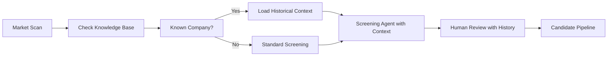
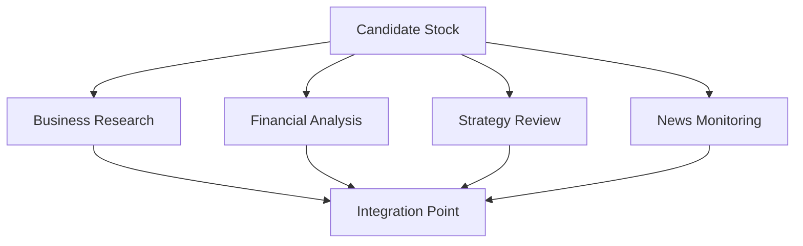
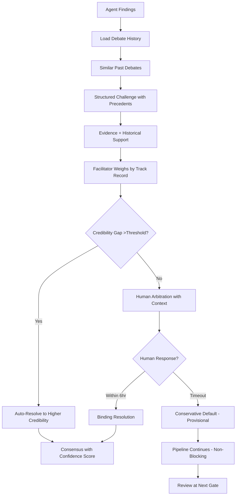
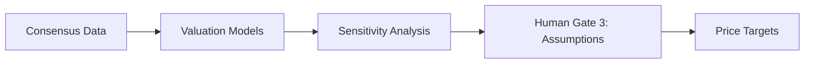
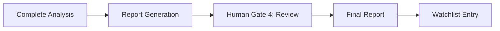
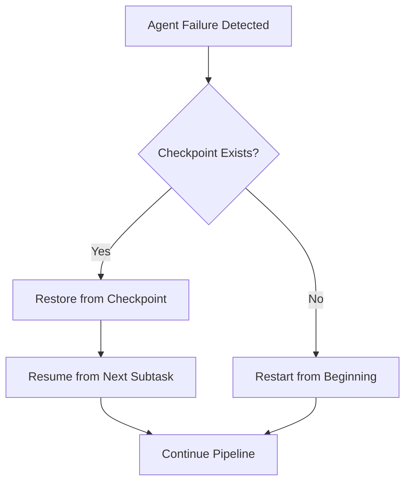

# Analysis Pipeline - Memory-Enhanced Workflow

## Overview

This document describes the core 12-day analysis cycle that powers the fundamental analysis system. The pipeline leverages institutional memory at every stage, enabling each analysis to build upon past learnings and continuously improve accuracy.

The workflow is organized into 5 major phases, each incorporating historical context and pattern recognition to enhance decision quality. Human oversight gates are strategically positioned to guide the system while capturing valuable expertise for future analyses.

---

## Memory-Enhanced Workflow

### Phase 0: Macro & Industry Analysis (Async, Cached)

**Duration**: Continuous (independent of stock-specific pipeline)
**Frequency**: Monthly reports + daily monitoring + event-driven updates

**Purpose**: Provide top-down macroeconomic context that informs all stock analyses.

**Agents**: Macro Analyst (Phase 2+)

**Activities**:

1. **Daily Regime Monitoring** (5min):
   - Query DD-008 regime detection for current market regime
   - Analyze regime implications (sector favorability, discount rates)
   - Detect regime changes (alert gates if confidence >80%)

2. **Daily Indicator Analysis** (10min):
   - Fetch economic indicators from FRED/IMF/OECD
   - Calculate percentiles, trends, significance
   - Identify threshold breaches (>95th or <5th percentile)

3. **Weekly Sector Scoring** (20min):
   - Calculate sector favorability scores (11 GICS sectors, 0-100)
   - Update sector valuations vs historical
   - Calculate 3-month momentum

4. **Monthly Macro Report** (2-4hr, 1st week of month):
   - Generate comprehensive PDF report (8-12 pages)
   - Update interactive dashboard
   - Publish to Gates 1/2/5 and all agents

5. **Ad-Hoc Updates** (event-driven):
   - Regime changes (confidence >80%)
   - Major Fed announcements (rate changes, policy shifts)
   - Threshold breaches sustained >3 days

**Outputs** (cached for all stock analyses):
- Current regime classification + confidence
- Sector favorability rankings (11 sectors)
- Discount rates by sector (for DCF models)
- Monthly macro report (PDF + dashboard + API)
- Economic indicator snapshot

**Integration**: Phase 1 (Screening) queries sector scores, Phase 4 (Valuation) queries discount rates

**Human Gates**: None (async background analysis, results available to Gates 1/2/5 on-demand)

**See**: [DD-022: Macro Analyst](../design-decisions/DD-022_MACRO_ANALYST_AGENT.md) for implementation details

---

### Phase 1: Memory-Informed Discovery (Days 1-2)



**Memory Activities**:

1. Query: "Have we analyzed this company before?"
2. Load: Previous recommendations, outcomes, lessons
3. Pattern match: "Similar companies that succeeded/failed"
4. **Macro Context Query** (NEW Phase 2+):
   - Current market regime and sector favorability rankings
   - Used to weight candidates by sector timing (not just fundamentals)
5. Present: Historical context to human reviewer

**Core Activities**:

1. Run quantitative screens
2. Generate candidate list
3. Create initial summaries
4. Human validation of candidates

### Phase 2: Parallel Analysis with Historical Context (Days 3-7)



**Parallel Workstreams**:

- Business model deep dive
- Financial statement analysis
- Management evaluation
- Current events tracking

**Memory Integration**:

Each specialist agent begins by loading relevant memories. The system retrieves:

- **Company history**: Previous analyses, recommendations, and outcomes
- **Sector patterns**: Industry-specific trends and success rates
- **Peer outcomes**: Performance of comparable companies
- **Macro context**: Market regime patterns and their impact
- **Agent expertise**: Historical accuracy of specific agents in similar contexts

This contextual loading ensures analysts don't start from scratch but build upon institutional knowledge accumulated over time.

### Phase 3: Memory-Powered Debate & Synthesis (Days 8-9)



**Debate Protocol (Non-Blocking with Fallbacks)**:

1. Each agent presents findings
2. Structured challenges issued (15min ack, 1hr evidence)
3. **Facilitator applies credibility-weighted auto-resolution if gap >threshold** (dynamic: max(0.25, CI_A + CI_B))
4. If unresolved, escalate to human (6hr timeout)
5. **If human unavailable, apply conservative default (provisional)**
6. **Pipeline continues with provisional resolution**
7. **Human reviews provisional decisions at next gate**

**Async Resolution Pathway**:

The system ensures debates never block pipeline progress:

**_Path A: Direct Resolution (No Human Needed)_**

- Agent consensus reached → Continue immediately
- Credibility gap >threshold (dynamic: max(0.25, CI_A + CI_B)) → Facilitator auto-resolves → Continue immediately

**_Path B: Human Resolution (Standard)_**

- Human arbitrates within 6 hours → Binding resolution → Continue

**_Path C: Provisional Resolution (Fallback)_**

- Human timeout after 6 hours → Conservative default applied → **Pipeline continues**
- Resolution marked "provisional - awaiting review"
- Override window opens until next gate
- Downstream analyses proceed with conservative assumption

**Provisional Resolution Handling**:

When conservative default is applied:

1. **Most Cautious Position Selected**:

   - Compare agent positions on risk spectrum
   - Select lowest price target, highest risk assessment, most conservative assumptions

2. **Downstream Continuation**:

   - Valuation agent receives provisional assumption
   - Proceeds with DCF modeling using conservative inputs
   - Final recommendation reflects conservative stance

3. **Gate Review Integration**:

   - At Gate 3 (Valuation) or Gate 5 (Final Decision):
     - Display: "2 provisional decisions require review"
     - Show conservative position applied vs alternative positions
     - Enable override with downstream impact analysis
   - If overridden:
     - Re-run affected valuations (typically 5-10min)
     - Update target prices and recommendations
     - Propagate changes through dependency chain

4. **Learning Capture**:
   - Track fallback accuracy (human override rate)
   - Learn which types of debates benefit from conservative defaults
   - Improve credibility scoring over time

**Memory Enhancement**:

The debate facilitator enhances discussions by:

- Pre-loading relevant precedents for all participants
- Retrieving historical debate outcomes on similar topics
- Weighting agent positions by historical accuracy
- Finding counter-examples from past analyses
- Checking pattern success rates to validate claims
- Resolving conflicts using historical outcomes
- **Tracking fallback resolution accuracy for calibration**
- **Learning conservative default effectiveness by debate type**

When agents disagree, the system can surface which position proved correct in similar past situations, enabling data-driven conflict resolution while still allowing human judgment to override when context differs. **If human unavailable, conservative defaults ensure pipeline progress while maintaining safety through provisional status and mandatory review.**

### Phase 4: Calibrated Valuation (Days 10-11)



**Valuation Process**:

1. Build financial models
2. Run multiple scenarios
3. Human validates assumptions
4. Generate target ranges

**Memory Calibration**:

Valuation models are calibrated using historical performance:

- **Model accuracy tracking**: Sector-specific historical errors
- **Assumption adjustment**: Calibrate inputs based on past prediction errors
- **Scenario weighting**: Apply historical probabilities to bull/base/bear cases
- **Confidence scoring**: Calculate based on track record in similar situations
- **Macro-Calibrated Discount Rates** (NEW Phase 2+):
  - Query Macro Analyst for sector-specific discount rates
  - Reflects current interest rate environment (vs arbitrary defaults)
  - Example: 11.5% in BEAR_HIGH_RATES vs 8% in BULL_LOW_RATES

For example, if the valuation agent has historically overestimated tech company growth by 8%, the system automatically adjusts current projections downward and widens confidence intervals appropriately.

### Phase 5: Documentation & Watchlist (Day 12)



**Documentation Activities**:

1. Synthesize all findings
2. Generate investment memo
3. Human reviews final report
4. Add to watchlist with alerts
5. Store analysis in knowledge base

**Memory Storage**:

All analysis outputs are stored in the knowledge base for future reference:

- Investment memos with full reasoning chains
- Agent consensus and dissent
- Human overrides and rationale
- Price targets and assumptions
- Risk factors identified
- Patterns matched during analysis

This creates a complete audit trail while building the institutional memory that future analyses will leverage.

---

## Pipeline Integration Points

### Data Collection Integration

Throughout all phases, the Data Collector Agent continuously:

- Monitors for new filings and disclosures
- Updates market data and price information
- Tracks news and material events
- Validates data quality and freshness

### News Monitor Integration

The News Monitor Agent runs in parallel across all phases:

- Alerts to material events requiring immediate attention
- Provides context for price movements
- Tracks competitor announcements
- Identifies regulatory developments
- Triggers re-analysis when thesis-changing events occur

### Quality Control Integration

The QC Agent validates work at each phase:

- Cross-verifies findings across agents
- Identifies contradictions requiring resolution
- Ensures checklist completion
- Validates data sources and calculations
- Flags inconsistencies for human review

---

## Failure Recovery & Pause/Resume

The pipeline supports graceful failure recovery and workflow pause/resume using checkpoint-based state persistence ([DD-011](../design-decisions/DD-011_AGENT_CHECKPOINT_SYSTEM.md), [DD-012](../design-decisions/DD-012_WORKFLOW_PAUSE_RESUME.md)).

### Checkpoint-Based Recovery

**How It Works**:

Each specialist agent saves execution state after completing each subtask:

- Subtask progress (completed/pending)
- Working memory snapshot (L1 cache dump)
- Intermediate results (partial findings)
- Execution context (config, retry count)

**Storage**: Dual-tier for reliability and speed

- PostgreSQL (durable, permanent record)
- Redis (fast recovery, 7-day TTL)

### Failure Classification (3-Tier System)

The system classifies failures into 3 tiers with different handling strategies:

| Tier | Failure Type  | Examples                                                   | Action     | Rationale           |
| ---- | ------------- | ---------------------------------------------------------- | ---------- | ------------------- |
| 1    | Transient     | Network timeout (<3x), rate limits (429), 5xx              | Auto-retry | Self-resolving      |
| 2    | Recoverable   | Agent crash, data quality, persistent API failure          | Auto-pause | Needs investigation |
| 3    | Irrecoverable | Data integrity violation, security breach, delisted ticker | Auto-fail  | Not fixable         |

**Tier 1 (Auto-Retry)**:

- Network timeouts (< 3 consecutive failures)
- Rate limit errors (HTTP 429) with exponential backoff
- Transient API unavailability (5xx with retry-after header)
- **Handling**: Retry with exponential backoff, max 3 attempts
- **Rationale**: High probability of self-resolution, low cost to retry

**Tier 2 (Auto-Pause)**:

- Agent crashes/unhandled exceptions
- Data quality failures (missing required SEC filings, corrupt data)
- Dependency failures (upstream agent failed, cannot proceed)
- Resource exhaustion (OOM, disk full)
- Persistent API failures (3+ consecutive timeouts on same endpoint)
- **Handling**: Auto-pause with alert, save checkpoint, await resolution
- **Rationale**: Requires investigation or external fix, resumable after resolution

**Tier 3 (Auto-Fail)**:

- Data integrity violations (contradictory checkpoint data)
- Security violations (unauthorized access attempts)
- Configuration errors blocking entire pipeline
- Irrecoverable validation failures (ticker delisted, fundamentally flawed)
- **Handling**: Mark failed, notify human, remove from pipeline
- **Rationale**: Not fixable by pause/resume, requires redesign or stock removal

### Failure Recovery Workflow



**Recovery Process**:

1. **Failure Detection**: Lead Coordinator detects agent failure (API rate limit, network error, resource exhaustion)
2. **Checkpoint Lookup**: Query checkpoint storage for most recent state
3. **State Restoration**:
   - Fast path: Restore from Redis (<5s)
   - Fallback: Restore from PostgreSQL (<30s)
4. **Resume Execution**: Agent continues from next pending subtask
5. **Zero Duplicate Work**: Completed subtasks never re-executed

**Example Recovery**:

```text
Strategy Analyst - AAPL Analysis:
  ✅ historical_roi (completed - 10 min)
  ✅ ma_review (completed - 25 min)
  ❌ mgmt_compensation (failed at 45% - Koyfin rate limit)

[Recovery triggered]
  ↳ Checkpoint restored from Redis in 3s
  ↳ Resumed at mgmt_compensation subtask
  ↳ No re-work of historical_roi or ma_review
  ↳ Total recovery overhead: 3s vs 35 min restart
```

### Workflow Pause/Resume (DD-012)

The system supports per-stock pause/resume without affecting parallel analyses. When an analysis is paused, other stocks continue unaffected.

**Use Cases**:

- Tier 2 failures (auto-pause with alert)
- Human investigation needed (provisional decision review)
- Resource constraints (prioritize different analysis)
- External dependency (awaiting data provider response)
- Gate timeouts (24h human response limit exceeded)

**State Machine**:

```
                  Tier 2 Failure
    ┌─────────────────┐
    │                 │
    ▼                 │
RUNNING ──────► PAUSING ──────► PAUSED
                                  │
                                  │ Resume Triggered
                                  │
                                  ▼
                              RESUMING ──────► RUNNING
                                  │
                                  │ 14 days
                                  ▼
                               STALE ──────► EXPIRED (30d)
```

**States**:

- **RUNNING**: Normal analysis execution
- **PAUSING**: Saving checkpoint, coordinating agent shutdown
- **PAUSED**: Idle, awaiting manual/auto resume
- **RESUMING**: Loading checkpoint, restarting agents per plan
- **STALE**: Paused >14 days, marked for expiration
- **EXPIRED**: Purged from active tables (audit log only)

**Pause Workflow**:

1. Tier 2 failure detected (or manual trigger)
2. PauseManager saves checkpoint via DD-011
3. Analysis marked "PAUSED" with reason and timestamp
4. Alert sent to human (priority based on trigger)
5. Resources released (agents can work on other stocks)
6. L1 memory TTL extended from 24h → 14d

**Resume Workflow**:

1. Resume triggered (manual or auto when blocker resolved)
2. DependencyResolver creates resume plan:
   - **Skip**: Agents completed before pause (findings in Neo4j)
   - **Restart**: Failed agent + downstream dependents
   - **Continue**: Independent parallel agents (if checkpoint exists)
3. Checkpoint loaded via DD-011
4. **L1 working memory restored via DD-016**:
   - DualRecoveryStrategy attempts 3-tier fallback (L1 existing → Redis secondary → PostgreSQL)
   - Type preservation ensures all Redis types (string, list, hash, set, zset) restored correctly
   - ConsistencyVerifier runs SHA256 hash validation (fail-fast on mismatch)
   - TTL restored to 24h for active analysis
   - Zero duplicate work: agents continue from exact memory state
5. Agents resume per plan
6. Pipeline continues from pause point

**Dependency Resolution Example**:

```
Scenario: Financial Analyst fails on Day 4 of 12-day pipeline

State at Pause:
- Screening Agent: COMPLETED (Day 1-2)
- Business Research Agent: COMPLETED (Day 3-4)
- Financial Analyst: FAILED (Day 4)
- Strategy Analyst: IN_PROGRESS (Day 4, parallel)
- News Monitor: IN_PROGRESS (Day 1-12, independent)

Resume Plan Generated:
- Skip: Screening, Business Research (already completed)
- Restart: Financial Analyst (failed), Strategy Analyst (dependent), Valuation Agent (dependent)
- Continue: News Monitor (independent, no dependency on failed agent)

Result: Resume saves 2 days by skipping completed work, restarts 3 agents
```

**Batch Pause Scenario**:

```
Scenario: Koyfin API quota exhausted (10,000 requests/day)

Day 0, 2pm: Quota reached after 8 stock analyses
- 10 remaining stocks in batch encounter quota errors
- Batch pause triggered: pause_batch(stock_ids=[...], reason="Koyfin quota exceeded")
- All 10 stocks status: PAUSED
- Alert sent: "10 stocks paused - Koyfin quota exhausted, resumes at midnight"

Day 1, 12:01am: Quota reset detected
- Auto-resume triggered: resume_batch(stock_ids=[...], concurrency_limit=5)
- First 5 stocks resume concurrently
- After completion, next 5 stocks resume
- Alert sent: "Batch 'koyfin_quota_batch' resumed: 10/10 successful"

Efficiency: Single batch operation vs 10 individual pause/resume cycles
```

### Failure Correlation Detection (DD-017)

The system automatically detects correlated failures across multiple stocks and triggers batch operations without manual intervention.

**How It Works**:

When an agent fails, the FailureCorrelator analyzes the failure for correlation with recent failures (5min window):

1. **Error Signature Generation**:

   - Normalize error message: remove timestamps, UUIDs, request IDs
   - Extract semantic pattern: "Koyfin quota 1000/1000" → "api_quota_exceeded"
   - Generate hash: `hash(agent_type, error_type, data_source, pattern)`

2. **Temporal Correlation Detection**:

   - Query failures with matching signature within 5min window
   - Check batch threshold: ≥3 correlated failures = batch trigger

3. **Root Cause Inference**:

   - **API Quota**: 3+ stocks, same source, quota error → "{source} API quota exceeded"
   - **Network Outage**: 5+ stocks, same source, timeout → "{source} network connectivity"
   - **Data Unavailability**: 3+ stocks, 404 errors → "{source} data unavailable"
   - **Agent Bug**: 3+ stocks, same agent type, same error → "{agent} failure"

4. **Auto-Batch Trigger**:
   - If correlated: `BatchManager.pause_batch(stock_ids, root_cause, correlation_id)`
   - If not correlated (<3): Individual pause via standard Tier 2 handling

**Correlation Example**:

```
Timeline:
14:47:12 - AAPL Financial Analyst fails: "Koyfin API quota exceeded: 1000/1000"
  → FailureCorrelator: signature=koyfin:quota:api:abc1, wait for correlations...

14:47:18 - MSFT Financial Analyst fails: "Koyfin rate limit reached - 1000 requests"
  → FailureCorrelator: signature=koyfin:quota:api:abc1 (same), 2 failures detected

14:47:23 - GOOGL Strategy Analyst fails: "Koyfin quota error (request_id=xyz789)"
  → FailureCorrelator: signature=koyfin:quota:api:abc1 (same), 3 failures detected
  → Threshold met (≥3), infer root cause: "Koyfin API quota exceeded"
  → Auto-trigger batch pause for [AAPL, MSFT, GOOGL]

14:47:25 - AMZN Financial Analyst fails: "Koyfin quota exceeded"
  → FailureCorrelator: joins existing correlation, add AMZN to batch

14:47:30 - Alert sent to human:
  → "Koyfin API quota exceeded - 4 stocks paused"
  → 4 separate alert cards (DD-015 requirement) with "Resume All" button
  → Root cause: "Koyfin API quota exceeded"
  → Suggested resolution: "Quota resets at midnight, or upgrade Koyfin tier"

Total detection time: 18 seconds from first failure to batch trigger
Human action: One-click "Resume All" when quota restored
```

**Benefits vs Manual Correlation**:

- **Speed**: 30s detection vs hours (manual pattern recognition)
- **Scale**: Works at 100+ stocks (manual correlation impossible)
- **Efficiency**: 1 diagnosis vs N investigations (5 stocks = 5x time saved)
- **Automation**: Zero human intervention for grouping (vs manual batch creation)

**Integration Flow**:

```
Agent Failure → FailureCorrelator.on_agent_failure()
                    ↓
            Generate error signature
                    ↓
            Detect correlations (5min window)
                    ↓
            ┌─────────────────┐
            │ <3 failures?    │──Yes──→ Standard Tier 2 pause (individual)
            └─────────────────┘
                    │ No (≥3)
                    ↓
            Infer root cause
                    ↓
            Auto-trigger batch pause
                    ↓
            BatchManager.pause_batch()
                    ↓
            AlertManager (batch alerts)
```

**Timeout Escalation Timeline**:

```
Pause Timeout Lifecycle:

Day 0:  Pause occurs → Alert: "Stock AAPL paused - Financial Analyst failed: data quality issue"
Day 3:  Reminder → Alert: "3 stocks paused for 3+ days, review needed"
Day 7:  Warning → Alert: "Approaching expiration: 2 stocks paused 7+ days"
Day 14: Expiration → Status: STALE, moved to archive queue
Day 30: Purge → Deleted from active tables (audit log retained)

Grace Period: Human can extend to 30 days max with justification
```

**Integration with Human Gates**:

Pause/resume particularly useful for:

- **Gate 3** (Assumption Validation): Auto-pause on 24h timeout
- **Gate 4** (Debate Arbitration): Pause if human needs expert consultation
- **Gate 5** (Final Decision): Pause for investment committee scheduling

**Gate Timeout Example**:

```
Scenario: Gate 3 (Assumption Validation) times out after 24h

Timeline:
- Day 7, 9am: Valuation Agent reaches Gate 3, awaits human approval
- Day 7, 9am-Day 8, 7am: Gate in WAITING_FOR_HUMAN state (22h elapsed)
- Day 8, 7am-9am: Warning alerts sent, human not responsive (24h elapsed)
- Day 8, 9am: Gate times out
  - Action: Auto-pause analysis with reason "Gate 3 timeout, needs review"
  - Checkpoint saved at Gate 3 entry
  - Alert: "Gate 3 timeout for AAPL, analysis paused"

Human Review:
- Portfolio manager reviews pause queue
- Sees "Gate 3 timeout" reason, reviews valuation assumptions
- Validates assumptions manually, approves gate
- Triggers resume: resume_analysis('AAPL', resume_plan, notify=True)

Resume:
- Checkpoint loaded at Gate 3 entry
- Gate bypassed (already validated by human)
- Valuation Agent continues to next step
- Alert: "AAPL resumed - Gate 3 validated, analysis continuing"
```

**Checkpoint Integration (DD-011)**:

- Pause triggers checkpoint save before state transition
- Checkpoint includes: agent states, intermediate results, memory snapshots
- Resume loads checkpoint and rehydrates agent state
- If checkpoint corrupted → Tier 3 failure (auto-fail, no resume)

**Orchestrator Integration (Tech-Agnostic)**:

```python
# Pause flow
def handle_tier2_failure(stock_id, agent, reason):
    checkpoint_id = checkpoint_system.save(stock_id)  # DD-011
    pause_manager.pause_analysis(stock_id, reason, checkpoint_id)
    orchestrator.pause_workflow(f"stock_{stock_id}")  # Generic API

# Resume flow
def handle_resume(stock_id):
    resume_plan = dependency_resolver.create_resume_plan(stock_id)
    checkpoint_system.load(stock_id, resume_plan.checkpoint_id)
    orchestrator.resume_workflow(f"stock_{stock_id}")
    pause_manager.resume_analysis(stock_id, resume_plan, notify=True)
```

Supports: Airflow (DAG pause), Prefect (flow pause), Temporal (signal), Custom

### Checkpoint Retention

**Cleanup Policy**:

- **Success**: Delete checkpoints immediately after analysis completes
- **Failure**: Retain for 30 days (audit trail, debugging)
- **Manual Override**: Flag to preserve for investigation

**Storage Impact**: ~5 KB per checkpoint × 5 checkpoints/agent × 5 agents = ~125 KB per stock

---

## Timeline Management

### Standard 12-Day Cycle

| Phase | Days       | Activities                      | Gates          | Fallback Handling                                   |
| ----- | ---------- | ------------------------------- | -------------- | --------------------------------------------------- |
| 0     | Continuous | Macro/industry analysis         | N/A            | Monthly/weekly/daily scheduled                      |
| 1     | 1-2        | Screening & validation          | Gate 1         | Auto-proceed with top 10 (24hr)                     |
| 2     | 3-7        | Parallel specialist analysis    | Gate 2 (Day 3) | Standard checklist (12hr)                           |
| 3     | 8-9        | Debate & synthesis              | Gate 4         | **Conservative default (6hr), review at next gate** |
| 4     | 10-11      | Valuation modeling              | Gate 3         | Conservative estimates (24hr)                       |
| 5     | 12         | Documentation & watchlist setup | Gate 5         | Blocking (no auto-action)                           |

**Key Change**: Phase 3 debates are now **non-blocking**. If human unavailable, conservative defaults applied provisionally and pipeline continues. Provisional decisions reviewed at Gates 3 or 5.

### Accelerated Cycle (6 Days)

For time-sensitive opportunities:

- Days 1-2: Screening & validation
- Days 3-4: Parallel analysis (compressed)
- Day 5: Debate & valuation (combined)
- Day 6: Documentation

Requires:

- Higher human engagement
- More aggressive parallelization
- Reduced validation cycles

### Continuous Monitoring

For existing watchlist positions:

- Weekly: Price and news monitoring
- Monthly: Thesis validation check
- Quarterly: Full re-analysis
- Event-driven: Immediate review on material events

---

## Success Metrics

### Pipeline Performance

- **Throughput**: Number of stocks analyzed per month
- **Cycle time**: Days from screening to final decision
- **Accuracy**: Percentage of recommendations achieving targets
- **Efficiency**: Agent utilization and parallel processing effectiveness

### Memory Utilization

- **Context retrieval**: Percentage of analyses using historical data
- **Pattern application**: Frequency of pattern matching in decisions
- **Calibration impact**: Improvement from historical error correction
- **Learning rate**: Accuracy improvement over time

### Human Engagement

- **Gate response time**: Average time to human decision at gates
- **Override rate**: Frequency of human overrides to AI recommendations
- **Feedback quality**: Value of human insights captured
- **Time savings**: Hours saved through automation

---

## Memory System Monitoring (DD-018)

### Overview

Memory system failure resilience ([DD-018](../design-decisions/DD-018_MEMORY_FAILURE_RESILIENCE.md)) introduces three critical failure modes that require operational monitoring and alerting:

- **C5**: Query fallback recursion protection (prevents infinite timeout loops)
- **A4**: Event-driven sync backpressure (prevents queue overflow during debates)
- **M5**: Regime detection sequencing (prevents credibility score staleness)

### Monitoring Metrics

**Query Performance (C5)**:

| Metric                      | Target               | Alert Threshold            | Action                                                          |
| --------------------------- | -------------------- | -------------------------- | --------------------------------------------------------------- |
| Query timeout rate          | <5%                  | >5% in 5min window         | Investigate database performance, check L1/L2/L3 response times |
| Fallback depth distribution | 90% depth=0 (L1 hit) | >20% exhaust all fallbacks | Database optimization required, cache warming needed            |
| Query response time p99     | <500ms               | >2s                        | Performance degradation, check query plans                      |

**Sync Queue Health (A4)**:

| Metric                     | Target       | Alert Threshold                                     | Action                                                |
| -------------------------- | ------------ | --------------------------------------------------- | ----------------------------------------------------- |
| Sync queue depth per agent | <30 messages | >50 messages (backpressure active)                  | Scale agent capacity, reduce sync event rate          |
| Backpressure events        | 0/hour       | >5/hour                                             | Investigate sync burst sources (debates, human gates) |
| Sync drop rate             | 0%           | >1% normal syncs dropped, >0% high/critical dropped | Agent load balancing, BatchManager pause trigger      |

**Regime Update Performance (M5)**:

| Metric                      | Target | Alert Threshold            | Action                                           |
| --------------------------- | ------ | -------------------------- | ------------------------------------------------ |
| Regime update duration p99  | <5min  | >5min (staleness SLA miss) | Optimize regime detection algorithm              |
| Regime cache timeout events | 0/day  | >1/day                     | Investigate regime detection hangs               |
| Credibility staleness       | <5min  | >10min                     | Manual regime update trigger, human notification |

### Alert Handling Procedures

**Query Timeout Exhausted (WARNING)**:

1. **Detection**: All fallback layers timeout (L1 → L2 → cached)
2. **Immediate action**: Query returns empty result + error flag to agent
3. **Investigation**: Check database performance metrics (CPU, query queue, slow queries)
4. **Escalation**: If timeout rate >5% for >10min, trigger HIGH alert and human notification
5. **Resolution**: Database optimization, query plan review, cache warming

**Sync Queue Overflow (HIGH)**:

1. **Detection**: Queue depth >50 messages, backpressure active
2. **Immediate action**: Lead Coordinator reduces sync event rate, BatchManager pauses low-priority analyses
3. **Investigation**: Identify sync burst source (debate, human gate, alert storm)
4. **Escalation**: If overflow persists >5min, scale agent capacity (spin up more instances)
5. **Resolution**: Agent load balancing, sync priority tuning, concurrency limits

**Sync Permanently Dropped (WARNING/HIGH)**:

1. **Detection**: Sync dropped after 5 retries (exponential backoff exhausted)
2. **Immediate action**:
   - Normal priority: Log drop, continue
   - High priority: Re-request sync with critical priority, notify human
3. **Investigation**: Check receiving agent load, queue depth history
4. **Resolution**: Agent capacity scaling, review sync priority assignment

**Regime Cache Timeout (HIGH)**:

1. **Detection**: Cache flag not set within 60s of regime detection start
2. **Immediate action**: Trigger manual regime update, alert human
3. **Investigation**: Check regime detection process logs, data source availability
4. **Escalation**: If timeout persists, disable regime-specific credibility until resolved
5. **Resolution**: Fix regime detection hang, validate data source connectivity

**Regime Staleness SLA Miss (WARNING)**:

1. **Detection**: 99th percentile regime update duration >5min
2. **Immediate action**: Log performance degradation, monitor credibility system
3. **Investigation**: Profile regime detection algorithm, check data source latency
4. **Escalation**: If p99 >10min, trigger HIGH alert and optimization task
5. **Resolution**: Optimize regime detection, reduce data source roundtrips

### Monitoring Dashboard

**Memory System Health (Real-Time)**:

```text
┌─────────────────────────────────────────────────────────────┐
│ Memory System Health Dashboard                              │
├─────────────────────────────────────────────────────────────┤
│ Query Performance (C5)                                       │
│   Timeout Rate: 2.3% ✓ (target <5%)                         │
│   Fallback Depth: L1=85% L2=12% Cached=3% Exhausted=0% ✓    │
│   Response Time p99: 420ms ✓ (target <500ms)                │
├─────────────────────────────────────────────────────────────┤
│ Sync Queue Health (A4)                                       │
│   Queue Depth: Financial=12, Strategy=8, Valuation=5 ✓      │
│   Backpressure Events: 0/hour ✓                             │
│   Sync Drop Rate: 0.0% ✓                                    │
├─────────────────────────────────────────────────────────────┤
│ Regime Update (M5)                                           │
│   Last Update: 4.2min ago ✓ (target <5min)                  │
│   Update Duration p99: 4.8min ✓ (target <5min)              │
│   Cache Timeouts: 0 today ✓                                 │
└─────────────────────────────────────────────────────────────┘
```

**Alert History (Last 24h)**:

| Time  | Alert                                  | Severity | Status       | Resolution                                        |
| ----- | -------------------------------------- | -------- | ------------ | ------------------------------------------------- |
| 14:23 | Sync Queue Overflow (Financial Agent)  | HIGH     | RESOLVED     | Paused 10 low-priority analyses, queue normalized |
| 09:15 | Query Timeout Rate >5%                 | WARNING  | RESOLVED     | Database query plan optimized, timeout rate <2%   |
| 02:30 | Regime Staleness SLA Miss (p99=6.2min) | WARNING  | ACKNOWLEDGED | Monitoring, no immediate action                   |

### Integration with Existing Monitoring

**Prometheus Metrics**:

```yaml
# Query performance (C5)
memory_query_timeout_rate: gauge (0-1, alert >0.05)
memory_query_fallback_depth: histogram (buckets: 0,1,2,exhausted)
memory_query_response_time_ms: histogram (p99 target <500ms)

# Sync queue health (A4)
memory_sync_queue_depth: gauge per agent (alert >50)
memory_sync_backpressure_active: gauge (0/1 boolean)
memory_sync_dropped_total: counter by priority (alert >0 for critical)

# Regime update (M5)
memory_regime_update_duration_min: histogram (p99 target <5min)
memory_regime_cache_timeouts_total: counter (alert >1/day)
memory_regime_staleness_min: gauge (alert >5min)
```

**Grafana Dashboards**:

- **Memory System Overview**: Query timeout rate, sync queue depth, regime update duration
- **Failure Mode Alerts**: Alert history, resolution status, MTTR by alert type
- **Agent Health**: Per-agent queue depth, backpressure events, sync drop rates

**PagerDuty Integration**:

- HIGH alerts: Immediate page to on-call engineer
- WARNING alerts: Slack notification, email
- Escalation: If HIGH alert unacknowledged for 15min, escalate to senior engineer

### Operational Runbooks

**Runbook: Query Timeout Rate >5%**:

1. Check database CPU/memory utilization
2. Review slow query logs (queries >500ms)
3. Analyze query plans for inefficient scans
4. Warm cache with preload queries
5. If persists, scale database (vertical or horizontal)

**Runbook: Sync Queue Overflow**:

1. Identify receiving agent with overflow
2. Check recent sync burst events (debates, human gates)
3. Pause low-priority analyses via BatchManager
4. Scale agent instances if persistent overflow
5. Review sync priority assignment for optimization

**Runbook: Regime Staleness >10min**:

1. Check regime detection logs for errors
2. Validate data source connectivity (FRED, CBOE APIs)
3. Profile regime detection algorithm bottlenecks
4. Trigger manual regime update
5. Disable regime-specific credibility if unresolved

See [DD-018 Memory Failure Resilience](../design-decisions/DD-018_MEMORY_FAILURE_RESILIENCE.md) for complete failure mode design and implementation details.

---

## Related Documentation

### Core Documentation

- [System Design v2.0](../../multi_agent_fundamental_analysis_v2.0.md) - Complete system specification
- [Agent Architecture](../architecture/agents.md) - Detailed agent specifications
- [Memory Architecture](../architecture/memory.md) - Memory system design

### Operations Documentation

- [Human Integration](./02-human-integration.md) - Human decision gates and interfaces
- [Data Management](./03-data-management.md) - Data sources and storage
- [Learning Systems](./learning-systems.md) - Continuous improvement mechanisms

### Implementation Guides

- [Pipeline Deployment](../implementation/pipeline-deployment.md) - Setup and configuration
- [Monitoring & Alerts](../implementation/monitoring.md) - Observability setup
- [Performance Tuning](../implementation/performance-tuning.md) - Optimization guides
