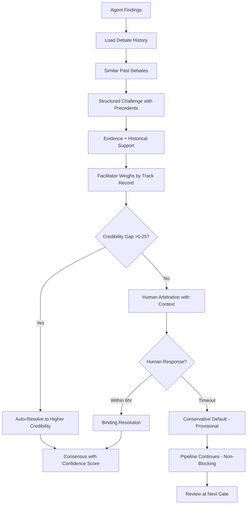

# Analysis Pipeline - Memory-Enhanced Workflow

## Overview

This document describes the core 12-day analysis cycle that powers the fundamental analysis system. The pipeline leverages institutional memory at every stage, enabling each analysis to build upon past learnings and continuously improve accuracy.

The workflow is organized into 5 major phases, each incorporating historical context and pattern recognition to enhance decision quality. Human oversight gates are strategically positioned to guide the system while capturing valuable expertise for future analyses.

---

## Memory-Enhanced Workflow

### Phase 1: Memory-Informed Discovery (Days 1-2)

**Memory Activities**:

1. Query: "Have we analyzed this company before?"
2. Load: Previous recommendations, outcomes, lessons
3. Pattern match: "Similar companies that succeeded/failed"
4. Present: Historical context to human reviewer

**Core Activities**:

1. Run quantitative screens
2. Generate candidate list
3. Create initial summaries
4. Human validation of candidates

### Phase 2: Parallel Analysis with Historical Context (Days 3-7)

**Parallel Workstreams**:

- Business model deep dive
- Financial statement analysis
- Management evaluation
- Current events tracking

**Memory Integration**:

Each specialist agent begins by loading relevant memories. The system retrieves:

- **Company history**: Previous analyses, recommendations, and outcomes
- **Sector patterns**: Industry-specific trends and success rates
- **Peer outcomes**: Performance of comparable companies
- **Macro context**: Market regime patterns and their impact
- **Agent expertise**: Historical accuracy of specific agents in similar contexts

This contextual loading ensures analysts don't start from scratch but build upon institutional knowledge accumulated over time.

### Phase 3: Memory-Powered Debate & Synthesis (Days 8-9)

**Debate Protocol (Non-Blocking with Fallbacks)**:

1. Each agent presents findings
2. Structured challenges issued (15min ack, 1hr evidence)
3. **Facilitator applies credibility-weighted auto-resolution if gap >0.25**
4. If unresolved, escalate to human (6hr timeout)
5. **If human unavailable, apply conservative default (provisional)**
6. **Pipeline continues with provisional resolution**
7. **Human reviews provisional decisions at next gate**

**Async Resolution Pathway**:

The system ensures debates never block pipeline progress:

**Path A: Direct Resolution (No Human Needed)**

- Agent consensus reached → Continue immediately
- Credibility gap >0.25 → Facilitator auto-resolves → Continue immediately

**Path B: Human Resolution (Standard)**

- Human arbitrates within 6 hours → Binding resolution → Continue

**Path C: Provisional Resolution (Fallback)**

- Human timeout after 6 hours → Conservative default applied → **Pipeline continues**
- Resolution marked "provisional - awaiting review"
- Override window opens until next gate
- Downstream analyses proceed with conservative assumption

**Provisional Resolution Handling**:

When conservative default is applied:

1. **Most Cautious Position Selected**:

   - Compare agent positions on risk spectrum
   - Select lowest price target, highest risk assessment, most conservative assumptions

2. **Downstream Continuation**:

   - Valuation agent receives provisional assumption
   - Proceeds with DCF modeling using conservative inputs
   - Final recommendation reflects conservative stance

3. **Gate Review Integration**:

   - At Gate 3 (Valuation) or Gate 5 (Final Decision):
     - Display: "2 provisional decisions require review"
     - Show conservative position applied vs alternative positions
     - Enable override with downstream impact analysis
   - If overridden:
     - Re-run affected valuations (typically 5-10min)
     - Update target prices and recommendations
     - Propagate changes through dependency chain

4. **Learning Capture**:
   - Track fallback accuracy (human override rate)
   - Learn which types of debates benefit from conservative defaults
   - Improve credibility scoring over time

**Memory Enhancement**:

The debate facilitator enhances discussions by:

- Pre-loading relevant precedents for all participants
- Retrieving historical debate outcomes on similar topics
- Weighting agent positions by historical accuracy
- Finding counter-examples from past analyses
- Checking pattern success rates to validate claims
- Resolving conflicts using historical outcomes
- **Tracking fallback resolution accuracy for calibration**
- **Learning conservative default effectiveness by debate type**

When agents disagree, the system can surface which position proved correct in similar past situations, enabling data-driven conflict resolution while still allowing human judgment to override when context differs. **If human unavailable, conservative defaults ensure pipeline progress while maintaining safety through provisional status and mandatory review.**

### Phase 4: Calibrated Valuation (Days 10-11)

**Valuation Process**:

1. Build financial models
2. Run multiple scenarios
3. Human validates assumptions
4. Generate target ranges

**Memory Calibration**:

Valuation models are calibrated using historical performance:

- **Model accuracy tracking**: Sector-specific historical errors
- **Assumption adjustment**: Calibrate inputs based on past prediction errors
- **Scenario weighting**: Apply historical probabilities to bull/base/bear cases
- **Confidence scoring**: Calculate based on track record in similar situations

For example, if the valuation agent has historically overestimated tech company growth by 8%, the system automatically adjusts current projections downward and widens confidence intervals appropriately.

### Phase 5: Documentation & Watchlist (Day 12)

**Documentation Activities**:

1. Synthesize all findings
2. Generate investment memo
3. Human reviews final report
4. Add to watchlist with alerts
5. Store analysis in knowledge base

**Memory Storage**:

All analysis outputs are stored in the knowledge base for future reference:

- Investment memos with full reasoning chains
- Agent consensus and dissent
- Human overrides and rationale
- Price targets and assumptions
- Risk factors identified
- Patterns matched during analysis

This creates a complete audit trail while building the institutional memory that future analyses will leverage.

---

## Pipeline Integration Points

### Data Collection Integration

Throughout all phases, the Data Collector Agent continuously:

- Monitors for new filings and disclosures
- Updates market data and price information
- Tracks news and material events
- Validates data quality and freshness

### News Monitor Integration

The News Monitor Agent runs in parallel across all phases:

- Alerts to material events requiring immediate attention
- Provides context for price movements
- Tracks competitor announcements
- Identifies regulatory developments
- Triggers re-analysis when thesis-changing events occur

### Quality Control Integration

The QC Agent validates work at each phase:

- Cross-verifies findings across agents
- Identifies contradictions requiring resolution
- Ensures checklist completion
- Validates data sources and calculations
- Flags inconsistencies for human review

---

## Timeline Management

### Standard 12-Day Cycle

| Phase | Days  | Activities                      | Gates          | Fallback Handling                                   |
| ----- | ----- | ------------------------------- | -------------- | --------------------------------------------------- |
| 1     | 1-2   | Screening & validation          | Gate 1         | Auto-proceed with top 10 (24hr)                     |
| 2     | 3-7   | Parallel specialist analysis    | Gate 2 (Day 3) | Standard checklist (12hr)                           |
| 3     | 8-9   | Debate & synthesis              | Gate 4         | **Conservative default (6hr), review at next gate** |
| 4     | 10-11 | Valuation modeling              | Gate 3         | Conservative estimates (24hr)                       |
| 5     | 12    | Documentation & watchlist setup | Gate 5         | Blocking (no auto-action)                           |

**Key Change**: Phase 3 debates are now **non-blocking**. If human unavailable, conservative defaults applied provisionally and pipeline continues. Provisional decisions reviewed at Gates 3 or 5.

### Accelerated Cycle (6 Days)

For time-sensitive opportunities:

- Days 1-2: Screening & validation
- Days 3-4: Parallel analysis (compressed)
- Day 5: Debate & valuation (combined)
- Day 6: Documentation

Requires:

- Higher human engagement
- More aggressive parallelization
- Reduced validation cycles

### Continuous Monitoring

For existing watchlist positions:

- Weekly: Price and news monitoring
- Monthly: Thesis validation check
- Quarterly: Full re-analysis
- Event-driven: Immediate review on material events

---

## Success Metrics

### Pipeline Performance

- **Throughput**: Number of stocks analyzed per month
- **Cycle time**: Days from screening to final decision
- **Accuracy**: Percentage of recommendations achieving targets
- **Efficiency**: Agent utilization and parallel processing effectiveness

### Memory Utilization

- **Context retrieval**: Percentage of analyses using historical data
- **Pattern application**: Frequency of pattern matching in decisions
- **Calibration impact**: Improvement from historical error correction
- **Learning rate**: Accuracy improvement over time

### Human Engagement

- **Gate response time**: Average time to human decision at gates
- **Override rate**: Frequency of human overrides to AI recommendations
- **Feedback quality**: Value of human insights captured
- **Time savings**: Hours saved through automation

---

## Related Documentation

### Core Documentation

- [System Design v2.0](../../multi_agent_fundamental_analysis_v2.0.md) - Complete system specification
- [Agent Architecture](../architecture/agents.md) - Detailed agent specifications
- [Memory Architecture](../architecture/memory.md) - Memory system design

### Operations Documentation

- [Human Integration](./02-human-integration.md) - Human decision gates and interfaces
- [Data Management](./03-data-management.md) - Data sources and storage
- [Learning Systems](./learning-systems.md) - Continuous improvement mechanisms

### Implementation Guides

- [Pipeline Deployment](../implementation/pipeline-deployment.md) - Setup and configuration
- [Monitoring & Alerts](../implementation/monitoring.md) - Observability setup
- [Performance Tuning](../implementation/performance-tuning.md) - Optimization guides
