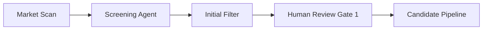
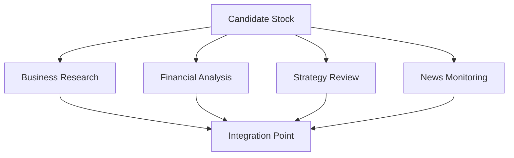
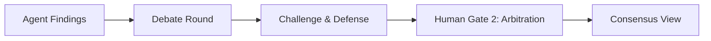
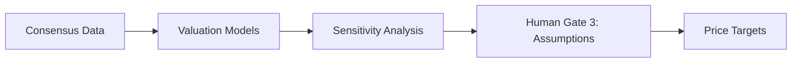
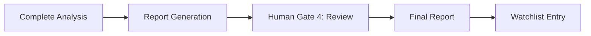

# Multi-Agent Fundamental Analysis System Design Document

## Version 1.0

**Date:** November 2025  
**Status:** Draft  
**Classification:** Internal

---

## Table of Contents

1. [Executive Summary](#executive-summary)
2. [System Overview](#system-overview)
3. [Agent Architecture](#agent-architecture)
4. [Workflow Design](#workflow-design)
5. [Human-in-the-Loop Integration](#human-in-the-loop-integration)
6. [Communication Protocols](#communication-protocols)
7. [Data Management](#data-management)
8. [Implementation Roadmap](#implementation-roadmap)
9. [Appendices](#appendices)

---

## Executive Summary

### Purpose

This document outlines the design for a multi-agent system that performs comprehensive fundamental analysis on stocks, mimicking the structure and collaborative approach of human analyst teams.

### Key Objectives

- Automate screening and initial analysis of investment opportunities
- Provide thorough fundamental analysis across business, financial, and strategic dimensions
- Enable human oversight and input at critical decision points
- Maintain institutional knowledge and improve over time
- Generate professional investment reports and maintain watchlists

### Core Principles

- **Parallel Processing**: Multiple agents work simultaneously on different aspects
- **Collaborative Intelligence**: Agents debate and validate each other's findings
- **Human Augmentation**: Human expertise enhances automated analysis
- **Transparency**: All reasoning and decisions are auditable
- **Continuous Learning**: System improves through feedback loops

---

## System Overview

### High-Level Architecture

```text
┌─────────────────────────────────────────────────────────┐
│                   Human Interface Layer                   │
│         Dashboard | Notifications | Feedback Loop         │
└─────────────────────────────────────────────────────────┘
                              ▲
                              ▼
┌─────────────────────────────────────────────────────────┐
│                   Coordination Layer                      │
│    Lead Coordinator | Debate Facilitator | QC Agent      │
└─────────────────────────────────────────────────────────┘
                              ▲
                              ▼
┌─────────────────────────────────────────────────────────┐
│                  Specialist Agent Layer                   │
│  Screening | Business | Financial | Strategy | Valuation  │
└─────────────────────────────────────────────────────────┘
                              ▲
                              ▼
┌─────────────────────────────────────────────────────────┐
│                     Support Layer                         │
│   Data Collector | News Monitor | Report Writer          │
└─────────────────────────────────────────────────────────┘
                              ▲
                              ▼
┌─────────────────────────────────────────────────────────┐
│                    Data Infrastructure                    │
│    APIs | Databases | Document Storage | Model Storage    │
└─────────────────────────────────────────────────────────┘
```

### Analysis Pipeline

1. **Screening** → Identify candidates based on financial metrics
2. **Business Understanding** → Deep dive into operations and model
3. **Financial Analysis** → Comprehensive review of statements and metrics
4. **Strategic Assessment** → Evaluate management and future plans
5. **Valuation** → Determine fair value and price targets
6. **Documentation** → Generate reports and maintain watchlists

---

## Agent Architecture

### Primary Specialist Agents

#### 1. Screening Agent

**Purpose**: Initial filtering and candidate identification

**Responsibilities**:

- Monitor financial screeners (Finviz, custom screeners)
- Apply quantitative filters:
  - 10-year revenue CAGR
  - Operating profit margin
  - Net debt/EBITDA ratios
- Generate one-page company summaries
- Prioritize candidates for deeper analysis

**Key Metrics Tracked**:

- Screening efficiency rate
- False positive/negative rates
- Time to identify opportunities

#### 2. Business Research Agent

**Purpose**: Deep understanding of business operations

**Responsibilities**:

- Analyze SEC filings (10-K, 10-Q, 8-K)
- Evaluate business segments and revenue streams
- Assess geographic exposure
- Identify competitive advantages
- Maintain SWOT analysis framework
- Track key performance indicators (KPIs)

**Research Framework**:

```text
Strengths    | Weaknesses
-------------|-------------
- Moats      | - Risks
- Market pos.| - Dependencies

Opportunities| Threats
-------------|-------------
- Growth     | - Competition
- Expansion  | - Regulation
```

#### 3. Financial Analyst Agent

**Purpose**: Quantitative analysis of financial health

**Responsibilities**:

- Process financial statements
- Calculate growth rates (5/10/15-year CAGR)
- Generate common-size statements
- Compute financial ratios:
  - Profitability (ROE, ROA, ROIC)
  - Efficiency (asset turnover, working capital)
  - Leverage (debt/equity, interest coverage)
  - Liquidity (current ratio, quick ratio)
- Perform peer comparisons
- Identify accounting red flags

**Red Flag Detection**:

- Related-party transactions
- Excessive management compensation
- Aggressive accounting policies
- Unusual adjustments

#### 4. Strategy Analyst Agent

**Purpose**: Evaluate strategic direction and execution

**Responsibilities**:

- Analyze capital allocation decisions
- Review management track record
- Process earnings call transcripts
- Evaluate M&A strategy
- Assess strategic priorities
- Monitor capital expenditure plans

**Evaluation Metrics**:

- Historical ROI (5/10/15-year averages)
- Return on Capital Employed (ROCE)
- Return on Invested Capital (ROIC)
- Execution success rate

#### 5. Valuation Agent

**Purpose**: Determine fair value and price targets

**Responsibilities**:

- Relative valuation:
  - P/E, EV/EBITDA, FCF yield
  - Forward and trailing multiples
- Absolute valuation:
  - DCF modeling
  - Sensitivity analysis
  - Scenario planning
- Incorporate current events impact
- Set price targets and entry points
- Technical analysis for timing

### Support Agents

#### 6. Data Collector Agent

**Purpose**: Manage data acquisition and storage

**Responsibilities**:

- Interface with data APIs
- Parse and structure documents
- Maintain data freshness
- Handle rate limiting
- Ensure data quality

**Data Sources**:

- SEC EDGAR
- Financial data providers (Koyfin, Bloomberg, Refinitiv)
- Company websites
- Industry reports

#### 7. News & Events Monitor Agent

**Purpose**: Track real-time developments

**Responsibilities**:

- Monitor news feeds
- Identify material events
- Assess impact on thesis
- Trigger re-analysis when needed
- Provide context for volatility

#### 8. Quality Control Agent

**Purpose**: Ensure analysis integrity

**Responsibilities**:

- Cross-verify findings
- Identify contradictions
- Seek opposing viewpoints
- Validate assumptions
- Ensure checklist completion

### Coordination Agents

#### 9. Lead Analyst Coordinator

**Purpose**: Orchestrate overall workflow

**Responsibilities**:

- Manage task assignments
- Resolve conflicts
- Make go/no-go decisions
- Ensure timeline adherence
- Escalate to humans when needed

#### 10. Debate Facilitator Agent

**Purpose**: Structure collaborative analysis

**Responsibilities**:

- Organize discussion rounds
- Present opposing viewpoints
- Document consensus and dissent
- Force position defense
- Highlight uncertainties

### Output Agents

#### 11. Report Writer Agent

**Purpose**: Generate professional documentation

**Responsibilities**:

- Synthesize findings
- Create investment memos
- Produce executive summaries
- Maintain consistent narrative
- Format for different audiences

#### 12. Watchlist Manager Agent

**Purpose**: Ongoing position monitoring

**Responsibilities**:

- Track analyzed stocks
- Set price alerts
- Trigger event-based reviews
- Manage DCA recommendations
- Update thesis as needed

---

## Workflow Design

### Phase 1: Discovery (Days 1-2)



**Activities**:

1. Run quantitative screens
2. Generate candidate list
3. Create initial summaries
4. Human validation of candidates

### Phase 2: Parallel Analysis (Days 3-7)



**Parallel Workstreams**:

- Business model deep dive
- Financial statement analysis
- Management evaluation
- Current events tracking

### Phase 3: Debate & Synthesis (Days 8-9)



**Debate Protocol**:

1. Each agent presents findings
2. Structured challenges issued
3. Evidence-based responses
4. Human breaks deadlocks
5. Document final positions

### Phase 4: Valuation & Decision (Days 10-11)



**Valuation Process**:

1. Build financial models
2. Run multiple scenarios
3. Human validates assumptions
4. Generate target ranges

### Phase 5: Documentation (Day 12)



---

## Human-in-the-Loop Integration

### Engagement Modes

#### 1. Full Autopilot Mode

- **Usage**: Routine screening and monitoring
- **Human Touch**: Weekly summary reviews
- **Decisions**: Auto-proceed with conservative defaults
- **Best For**: Large-scale screening, position monitoring

#### 2. Collaborative Mode (Recommended)

- **Usage**: New position analysis, major decisions
- **Human Touch**: Input at key gates
- **Decisions**: Human guided with AI support
- **Best For**: High-conviction investments

#### 3. Training Mode

- **Usage**: System improvement, complex situations
- **Human Touch**: Active guidance throughout
- **Decisions**: Human-led with AI learning
- **Best For**: Edge cases, new sectors

### Human Decision Gates

#### Gate 1: Screening Validation

**Input Required**: Approve/modify candidate list  
**Interface**: Ranked table with key metrics  
**Time Limit**: 24 hours  
**Default Action**: Proceed with top 10 candidates

#### Gate 2: Research Direction

**Input Required**: Identify focus areas and concerns  
**Interface**: SWOT summary with investigation prompts  
**Time Limit**: 12 hours  
**Default Action**: Standard checklist investigation

#### Gate 3: Assumption Validation

**Input Required**: Validate/adjust model parameters  
**Interface**: Interactive model dashboard  
**Time Limit**: 24 hours  
**Default Action**: Conservative estimates

#### Gate 4: Debate Arbitration

**Input Required**: Resolve significant disagreements  
**Interface**: Side-by-side comparison view  
**Time Limit**: 6 hours  
**Default Action**: Flag as high uncertainty

#### Gate 5: Final Decision

**Input Required**: Investment decision and sizing  
**Interface**: Executive summary with scoring  
**Time Limit**: None (blocking)  
**Default Action**: N/A - requires explicit approval

### Human Interface Design

#### Dashboard Components

```text
┌──────────────────────────────────────┐
│         Pipeline Overview            │
├──────────────────────────────────────┤
│ ▶ Screening    [12 new] [3 pending] │
│ ▶ Analysis     [8 active] [2 done]  │
│ ▶ Decisions    [4 awaiting]         │
└──────────────────────────────────────┘

┌──────────────────────────────────────┐
│        Pending Decisions             │
├──────────────────────────────────────┤
│ 🔴 AAPL valuation assumptions       │
│ 🟡 MSFT peer group validation       │
│ 🟢 GOOGL screening approval         │
└──────────────────────────────────────┘
```

#### Request Prioritization

| Priority | Description         | Response Time | Auto-Action          |
| -------- | ------------------- | ------------- | -------------------- |
| CRITICAL | Blocks all analysis | 2 hours       | Halt pipeline        |
| HIGH     | Major impact        | 6 hours       | Conservative proceed |
| MEDIUM   | Improves accuracy   | 24 hours      | Standard proceed     |
| LOW      | Nice-to-have        | 48 hours      | Skip                 |

### Expertise Routing

```yaml
Technical Analyst:
  - Entry/exit timing
  - Chart patterns
  - Technical indicators

Industry Specialist:
  - Business model assessment
  - Competitive dynamics
  - Industry trends

Financial Expert:
  - Accounting review
  - Model validation
  - Ratio analysis

Risk Manager:
  - Position sizing
  - Portfolio impact
  - Risk assessment
```

---

## Communication Protocols

### Inter-Agent Messaging

#### Message Structure

```json
{
  "from_agent": "financial_analyst",
  "to_agent": "valuation_agent",
  "message_type": "finding",
  "priority": "high",
  "content": {
    "finding": "Abnormal capex increase",
    "confidence": 0.85,
    "evidence": ["10-K page 45", "CFO commentary"],
    "impact": "Adjust FCF projections"
  },
  "timestamp": "2025-11-16T10:30:00Z",
  "requires_response": true
}
```

#### Message Types

- **Finding**: Share analytical results
- **Request**: Ask for specific analysis
- **Challenge**: Dispute another agent's conclusion
- **Confirmation**: Validate information
- **Alert**: Urgent attention needed

### Debate Protocol

#### Challenge Format

```json
{
  "challenge_id": "CH-001",
  "challenger": "strategy_analyst",
  "challenged": "financial_analyst",
  "disputed_finding": "Management effectiveness",
  "challenge_basis": "ROI declining despite claims",
  "required_evidence": ["Historical ROI data", "Peer comparison"],
  "escalation_timer": 3600
}
```

#### Response Requirements

1. Acknowledge within 15 minutes
2. Provide evidence within 1 hour
3. Escalate to human if unresolved
4. Document resolution

---

## Data Management

### Data Sources

#### Primary Sources

- **SEC Filings**: 10-K, 10-Q, 8-K, proxy statements
- **Company Data**: Investor presentations, earnings calls
- **Market Data**: Price history, volume, volatility
- **Industry Data**: Sector reports, competitor analysis

#### Secondary Sources

- **News Feeds**: Reuters, Bloomberg, specialized publications
- **Alternative Data**: Web traffic, app downloads, satellite imagery
- **Expert Networks**: Industry consultants, former employees
- **Social Sentiment**: Twitter, Reddit, StockTwits

### Data Storage Architecture

```text
/data
├── /raw
│   ├── /sec_filings
│   ├── /transcripts
│   ├── /market_data
│   └── /news_articles
├── /processed
│   ├── /financial_statements
│   ├── /ratios
│   ├── /sentiment_scores
│   └── /peer_comparisons
├── /models
│   ├── /dcf_models
│   ├── /relative_valuations
│   └── /sensitivity_analyses
└── /outputs
    ├── /reports
    ├── /watchlists
    └── /decision_logs
```

### Data Governance

#### Quality Assurance

- Source verification
- Timestamp validation
- Consistency checks
- Outlier detection
- Version control

#### Retention Policy

- Raw data: 5 years
- Processed data: 3 years
- Models: All versions retained
- Reports: Permanent
- Decision logs: Permanent

---

## Implementation Roadmap

### Phase 1: Foundation (Months 1-2)

- [ ] Set up data infrastructure
- [ ] Implement data collector agent
- [ ] Build screening agent
- [ ] Create basic dashboard
- [ ] Establish message protocols

### Phase 2: Core Agents (Months 3-4)

- [ ] Deploy financial analyst agent
- [ ] Deploy business research agent
- [ ] Implement debate facilitator
- [ ] Add human gate system
- [ ] Begin integration testing

### Phase 3: Advanced Features (Months 5-6)

- [ ] Add strategy analyst agent
- [ ] Build valuation agent
- [ ] Implement quality control
- [ ] Create report writer
- [ ] Full system testing

### Phase 4: Optimization (Months 7-8)

- [ ] Tune agent parameters
- [ ] Optimize human workflows
- [ ] Implement learning loops
- [ ] Performance benchmarking
- [ ] Production deployment

### Key Milestones

| Milestone    | Target Date | Success Criteria                  |
| ------------ | ----------- | --------------------------------- |
| MVP Launch   | Month 4     | Process 10 stocks end-to-end      |
| Beta Release | Month 6     | 50 stocks analyzed, 80% accuracy  |
| Production   | Month 8     | 200 stocks, <24hr turnaround      |
| Scale-up     | Month 12    | 1000+ stocks, minimal human input |

---

## Appendices

### Appendix A: Technical Requirements

#### Infrastructure

- **Compute**: Kubernetes cluster with auto-scaling
- **Storage**: 10TB minimum, expandable
- **Database**: PostgreSQL for structured data, MongoDB for documents
- **Message Queue**: RabbitMQ or Kafka for agent communication
- **APIs**: REST for external, gRPC for internal

#### Technology Stack

```yaml
Languages:
  - Python 3.11+ (agents)
  - TypeScript (dashboard)
  - SQL (data queries)

Frameworks:
  - FastAPI (agent services)
  - React (frontend)
  - Airflow (orchestration)
  - Pandas/NumPy (analysis)

ML/AI:
  - LangChain (agent framework)
  - OpenAI GPT-4 (NLP tasks)
  - Scikit-learn (predictions)
  - Prophet (time series)
```

### Appendix B: Risk Assessment

#### Technical Risks

| Risk            | Probability | Impact | Mitigation                           |
| --------------- | ----------- | ------ | ------------------------------------ |
| API rate limits | High        | Medium | Caching, multiple providers          |
| Data quality    | Medium      | High   | Validation layers, manual checks     |
| Model accuracy  | Medium      | High   | Human oversight, continuous training |
| System downtime | Low         | High   | Redundancy, graceful degradation     |

#### Business Risks

| Risk                     | Probability | Impact | Mitigation                              |
| ------------------------ | ----------- | ------ | --------------------------------------- |
| Regulatory changes       | Medium      | High   | Compliance monitoring, legal review     |
| Market volatility        | High        | Medium | Stress testing, conservative defaults   |
| Competitive disadvantage | Medium      | Medium | Continuous improvement, unique features |
| User adoption            | Medium      | High   | Intuitive UX, training program          |

### Appendix C: Compliance Considerations

#### Regulatory Requirements

- **SEC Compliance**: Ensure all recommendations follow investment advisor regulations
- **Data Privacy**: GDPR/CCPA compliance for any personal data
- **Fair Disclosure**: Avoid using material non-public information
- **Audit Trail**: Maintain complete records of all decisions

#### Best Practices

- Document all investment rationales
- Disclose AI involvement in analysis
- Maintain Chinese walls between public/private data
- Regular compliance audits
- Clear disclaimers on all reports

### Appendix D: Glossary

| Term  | Definition                                                           |
| ----- | -------------------------------------------------------------------- |
| Agent | Autonomous software component specialized in specific analysis tasks |
| CAGR  | Compound Annual Growth Rate                                          |
| DCF   | Discounted Cash Flow                                                 |
| DCA   | Dollar Cost Averaging                                                |
| Gate  | Human decision point in the workflow                                 |
| KPI   | Key Performance Indicator                                            |
| ROIC  | Return on Invested Capital                                           |
| SWOT  | Strengths, Weaknesses, Opportunities, Threats                        |

### Appendix E: Sample Outputs

#### One-Page Company Summary

```text
COMPANY: Apple Inc (AAPL)
SECTOR: Technology
MARKET CAP: $3.5T

FINANCIAL HEALTH: ■■■■■■■■□□ 8/10
- Revenue CAGR (10Y): 7.8%
- Operating Margin: 29.8%
- Net Debt/EBITDA: -0.5x (net cash)
- ROE: 147%

KEY STRENGTHS:
• Ecosystem lock-in
• Premium pricing power
• Services growth

KEY RISKS:
• China exposure (20% revenue)
• Regulatory scrutiny
• Market saturation

RECOMMENDATION: HOLD
Target Price: $195-210
Current Price: $189
```

#### Investment Decision Record

```text
DECISION ID: INV-2025-1116-001
STOCK: Microsoft (MSFT)
DATE: 2025-11-16

AGENTS CONSENSUS:
- Business: STRONG BUY (confidence: 92%)
- Financial: BUY (confidence: 85%)
- Strategy: BUY (confidence: 88%)
- Valuation: HOLD (confidence: 75%)

HUMAN OVERRIDES:
- Adjusted growth rate from 15% to 12%
- Changed peer group to exclude AMZN
- Approved position size: 2.5% of portfolio

FINAL DECISION: BUY
Entry Range: $420-425
Stop Loss: $400
Target: $500 (18 months)
```

---

## Document Control

### Version History

| Version | Date       | Author             | Changes                 |
| ------- | ---------- | ------------------ | ----------------------- |
| 1.0     | 2025-11-16 | System Design Team | Initial design document |

---
